# Beautiful Soup 笔记（基于`BeautifulSoup 4.4.1`）
`BeautifulSoup`是从HTML或者XML中提取数据的Python库。目前`Beautiful Soup 3`已经停止开发,推荐在现在的项目中使用`Beautiful Soup 4`, 安装的命令为`pip install beautifulsoup4`。
> 如果执行命令`pip install beautifulsoup`则安装的是`Beautiful Soup 3`

## 一、安装解析器
`BeautifulSoup`支持`Python`标准库中的HTML解析器，还支持一些第三方解析器，如`lxml`和`html5lib`。
其中`lxml`性能较好（C语言实现的），`html5lib`是纯Python实现，其解析方式与浏览器相同。
安装方式为：`pip install lxml`、`pip install html5lib`。

### 1. 使用解析器

- Python内置标准库解析`HTML`：`BeautifulSoup(markup,'html.parser')`。速度适中，容错能力强
- `lxml`解析`HTML`：`BeautifulSoup(markup,'lxml')`。速度快，容错能力强
- `lxml`解析`XML`：`BeautifulSoup(markup,'xml')`或者`BeautifulSoup(markup,['lxml','xml'])`。速度快，唯一支持`xml`的解析器
- `html5lib`解析`HTML`：`BeautifulSoup(markup,'html5lib')`。速度慢，最好的容错性。
  以浏览器的方式解析文档，可以生成HTML5格式的文档。

如果第二个参数为空，那么`BeautifulSoup`根据当前系统安装的库自动选择解析器，并且默认解析为`HTML`。解析器的优先顺序：`lxml>html5lib>Python标准库`。如果想解析成`XML`，则必须第二个参数传入`XML`。

> `markup`为待解析的字符串或者一个文件对象。文档首先被转换成字符串，并且所有的`HTML Entity`都被转义处理。

  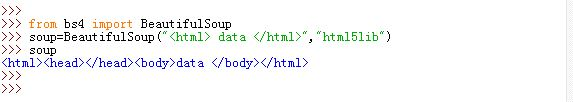

#### a.解析器之间的区别

`BeautifulSoup`为不同解析器提供了相同的接口，但是解析器本身是有区别的。同一份文档被不同解析器解析后可能生成不同结构的树型文档。

- 如果被解析的是标准`HTML`格式，则解析器之间解析结果没有任何区别，只是解析速度不同。返回的文档树完全相同。
- 如果被解析的不是标准`HTML`文档，那么不同解析器的解析结果可能不同。


## 二、BeautifulSoup 对象

`BeautifulSoup`将复杂的HTML文档转换成一个复杂的树形结构。每个节点都是`Python`对象。有四种节点对象：`Tag`、`NavigableString`、`BeautifulSoup`、`Comment`。

### 1. `Tag`对象

`Tag`对象与XML或者HTML原生文档中的`tag`相同，就是HTML中的标签。

  

`Tag`对象有两个最重要的属性：`name`和`attrs`属性：

- `name`：返回HTML标签的名字，通过`Tag`对象`.name`来获取。如果改变了`Tag`对象`name`，则会影响所有通过当前`BeautifulSoup`生成的`HTML`文档
- `attrs`：返回HTML标签的属性。
	- 你可以用`Tag.attrs`访问修改属性，操作方法与字典相同
	- 你可以用"Tag.key"直接取HTML标签属性

HTML标签中对于`class`等属性，它可能有多个值，那么`Tag`对象的`attrs`返回的是一个列表。HTML标签中对于`id`这种属性它只能有一个值，但是如果看起来像是两个值，则`Tag`对象的`attrs`返回字符串。另外如果文档是XML格式，则XML标签中不包含多值属性，如果`class`等属性有多个值，则将它们拼接成字符串，按照字符串处理。

将`Tag`对象转换成字符串时，多个值属性会合成为一个值，而不是对一个列表执行`str()`。

  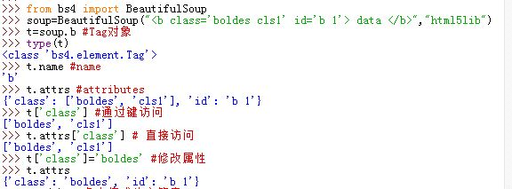

### 2. `NavigableString`对象
`NavigableString`对象表示标签包围的HTML文字内容，通过`Tag`对象的`.string`属性可获得对应的`NavigableString`对象。

- 可以通过`str()`方法直接将`NavigableString`对象转换成字符串。
- `NavigableString`对象的字符串内容不能编辑，但是可以整体替换掉，如`tag.string.replace_with("text2")`。

如果想在`BeautifulSoup`之外使用`NavigableString`对象，则建议调用`str()`方法将它转换成普通的字符串，否则会浪费内存。

  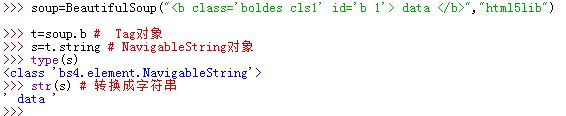

### 3. `BeautifulSoup`对象

`BeautifulSoup`对象表示的是一个文档的全部内容。大部分时候可以将它视为`Tag`对象进行遍历。但是它的`.name`属性固定为`'[document]'`，且`.attrs`属性为空。

  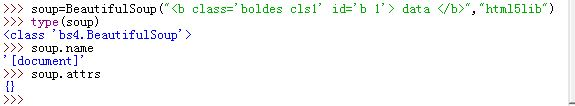

### 4. `Comment`对象以及其他特殊对象

`Comment`对象是一个特殊类型的`NavigableString`对象。当它出现在HTML文档中时，其格式化输出的方式与普通的`NavigableString`对象不同。

`CData`、`ProcessingInstruction`、`Declaration`、`Doctype`与` Comment` 对象类似，他们都是 `NavigableString` 的子类，只是都有各自的格式化输出方式。

  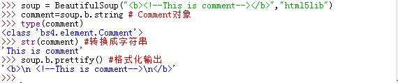

## 三、遍历文档树

### 1. 子节点

一个`Tag`可能包含多个`NaviableString`或者其他的`Tag`，这些都是这个`Tag`的子节点。`BeautifulSoup`提供了许多方法来遍历子节点。
>`NaviableString`没有子节点，因此无法遍历它

#### a. 通过`Tag`的名字遍历
操作文档树最简单的方法就是通过标签名字获取`Tag`。如果想获取`<head>`标签，只需要使用`soup.head`。

- 通过`soup.a`获得的只是标签`<a></a>`的第一个标签。要像获取所有的`<a></a>`标签，必须用`find_all()`等方法
- 可以如果想获取标签中的子标签，则可以反复使用`.`表达式，如:`soup.head.body.a`。

 

#### b. 通过`Tag.contents`和`Tag.children`遍历

`Tag`的`.contents`属性可以将`Tag`的子节点按照列表的方式输出。而通过`Tag`的`.children`生成器，可以对`Tag`的子节点进行循环。

- `BeautifulSoup`对象也可以按照这种方式进行遍历。因为`BeautifulSoup`对象一定会包含子节点，如`<html>`标签。
- `NavigableString`对象不能按照这种方式遍历。因为它没有子节点。
	>哪怕提供给`BeautifulSoup`构造函数的字符串并没有`<html></html>`标签，`BeautifulSoup`也会自动构造出`<html></html>`标签。

  

#### c. 通过`Tag.descendants`遍历

通过`Tag.contents`和`Tag.children`遍历时，只能访问`Tag`的直接子节点，而无法访问到孙节点以及孙节点以下节点。
而通过`Tag.descendants`可以获取`Tag`的所有子孙节点（无论是否直系子节点），注意`Tag.descendants`是一个生成器。

- `BeautifulSoup`对象也可以按照这种方式进行遍历。因为`BeautifulSoup`对象一定会包含子节点，如`<html>`标签。
- `NavigableString`对象不能按照这种方式遍历。因为它没有子节点。

  

#### d. 通过`Tag.string`遍历

- 如果`Tag`只有一个`NavigableString`类型的子节点，那么可以通过`Tag.string`获得该子节点。
- 如果`Tag`只有一个`Tag`类型的子节点，那么通过`Tag.string`获取的是该子节点的`.string`的结果。
- 如果`Tag`包含了多个子节点，那么`Tag.string`输出为`None`
- 如果`Tag`不包含任何子节点，则`Tag.string`输出为`None`

	>- `BeautifulSoup`对象也可以按照这种方式进行遍历。因为`BeautifulSoup`对象一定会包含子节点，
	  如`<html>`标签。
	>- `NavigableString`对象不能按照这种方式遍历。因为它没有子节点。

  

#### e. 通过`Tag.strings` 和 `Tag.stripped_strings`遍历

如果想访问`Tag`以及所有子节点（无论是否直系子节点）中的文本内容，可以使用`Tag.strings`进行循环获取。但是这种方式获取的结果可能含有大量空格或者空白行。在这种情况下可以用`Tag.stripped_strings`可以去除多余空白内容。这两个属性都返回的是生成器对象。
>`Tag.strings`生成器遍历时，它会读取`Tag`以及它所有子节点的文本内容，即使某个子节点没有文本
  （如`<div></div>`标签），此时该子节点的文本输出为空字符串。

- `BeautifulSoup`对象也可以按照这种方式进行遍历。因为`BeautifulSoup`对象一定会包含子节点，如`<html>`标签。
- `NavigableString`对象不能按照这种方式遍历。因为它没有子节点。

  

### 2.父节点

每个`Tag`或者`NavigableString`都有父节点（某个`Tag`对象）

#### a. 通过`.parent`访问父节点

可以通过`Tag.parent`获取`Tag`的父节点，通过`NavigableString.parent`获取`NavigableString`的父节点。

- 文档的顶层节点，如`<html>`的父节点是`BeautifulSoup`对象
- `BeautifulSoup`对象的父节点是`None`

  

#### b. 通过`.parents`访问节点

通过`Tag.parents`和`NavigableString.parents`可以递归得到元素的所有父辈节点。该属性返回的是一个生成器对象。

  

### 3. 兄弟节点

#### a. 通过`.next_sibling`和`.previous_sibling`遍历

在文档树中可以通过`Tag.next_sibling`或者`NavigableString.next_sibling`来查询后一个兄弟节点；通过`Tag.previous_sibling`者`NavigableString.previous_sibling`来查询前一个兄弟节点。

- 第一个节点的`.previous_sibling`返回`None`
- 最后一个节点的`.next_sibling`返回`None`

注意：对于`NavigableString`的兄弟节点一定是`Tag`节点或者为空，也可能是另一个`NavigableString`节点。而对于`Tag`节点的兄弟节点却不一定是`Tag`节点或者为空，因为也可能是`NavigableString`字符串节点（尤其是HTML显示时看起来是空白其实有换行符或者空白符的时候）。

#### b. 通过`.next_siblings`和`.previous_siblings`遍历

在文档树中可以通过`Tag.previous_siblings`或者`NavigableString.previous_siblings`来迭代本节点前面的兄弟节点；通过`Tag.next_siblings`者`NavigableString.next_siblings`来迭代本节点后面的兄弟节点。它们都是生成器对象。

  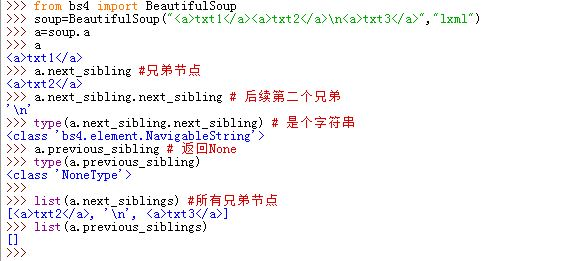

### 4. 回退和前进

对于文档


```
	<html>
	<head><title>The Dormouse's story</title></head>
	<p class="title"><b>The Dormouse's story</b></p>
	</html>
```

HTML 解析器将这段字符串转换成一连串的事件：

- 打开`<html>`标签
- 打开`<head>`标签
- 打开`<title>`标签
- 添加一段字符串
- 关闭`<title>`标签
- 关闭`<head>`标签
- 打开`<p>`标签
- ....

`Beautiful Soup`提供了重现这一过程的方法。

#### a. 通过`.next_element`和`.previous_element`遍历

在文档树中可以通过`Tag.next_element`或者`NavigableString.next_element`来获取本节点之后下一个被解析的对象（可能是`Tag`或者`NavigableString`）；也可以通过`Tag.previous_element`或者`NavigableString.previous_element`来获取本节点之前上一个被解析的对象（可能是`Tag`或者`NavigableString`）。
> `.next_element`可能与`.next_sibling`相同，也可能不同。对于`<a> txt</a><b></b>`这种HTML节点，标签`<a>`的下一个解析节点是`<a>`内部的字符串；标签`<a>`的下一个兄弟节点是`<b>`标签。

#### a. 通过`.next_elements`和`.previous_elements`遍历

在文档树中可以通过`Tag.previous_elements`或者`NavigableString.previous_elements`来迭代本节点前面解析的节点；通过`Tag.next_elements`者`NavigableString.next_elements`来迭代本节点后面解析的节点。它们都是生成器对象。

  


## 四、搜索文档树

### 1. 过滤器

过滤器贯穿了整个搜索的API。过滤器可以用于`Tag`的`name`中，
`Tag`的属性中，`NavigableString`字符串中或者他们的混合中。

#### a. 字符串过滤器

最简单的过滤器就是字符串。在搜索方法中传入一个字符串参数，`BeautifulSoup`会查找与字符串完整匹配的内容。

如果掺入字节码参数，则`BeautifulSoup`会将它作为`UTF-8`编码。

#### b. 正则表达式过滤器

如果传入正则表达式作为参数，则`BeautifulSoup`会通过正则表达式的`match()`来匹配内容。

#### c. 列表过滤器

如果传入列表参数，则`BeautifulSoup`将列表中任一元素匹配的内容返回。

#### d. `True`过滤器

如果传入`True`作为参数，则可以匹配任何值。

#### e. 自定义过滤器

你可以自定义一个方法，该方法只接受一个元素参数。如果这个方法返回`True`，则表示当前元素匹配并且被找到。
如果该方法返回`False`，则表示不匹配。	

  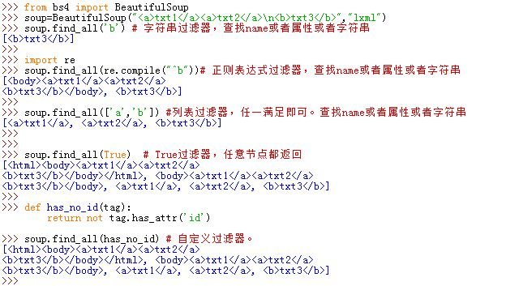

### 2. `find_all()`方法

`Tag.find_all(name,attrs,recursive,text,**kwargs)`：搜索当前`Tag`的子节点，并返回符合过滤器条件的子节点。

- `name`参数：查找所有名字为`name`的字`Tag`。对于`NavigableString`子节点会自动被忽略。
  搜索`name`参数的过滤器可以为字符串过滤器、正则表达式过滤器、列表过滤器、`True`过滤器。
- `keyword`参数：如果一个关键字参数的关键字不是`name`、`recursive`、`text`之一，
  则搜索时会将该关键字参数当作指定名字的`Tag`属性来搜索。如：`soup.find_all(id='a1')`
  将搜索`Tag`的`id`属性。
	- 这种类型的过滤器可以为字符串过滤器、正则表达式过滤器、列表过滤器、`True`过滤器。
	- 如果使用了多个关键字参数，则可以同时过滤`Tag`的多个属性
	- 有些`Tag`属性在搜索时不能使用，如`HTML5`中的`data-*`属性，此时可以用`attrs`
	  参数定义一个字典参数包含特殊属性的`Tag`。如:`soup.find_all=(attrs={'data-foo':'value'})`
	- 如果要搜索`Tag`的`CSS`属性，按理来说使用`class=xxx`关键字参数。
 	 但是`Python`中`class`是个保留字，因此`BeautifulSoup`使用`class_`关键字参数搜索有指定`CSS`
	  类名的`Tag`。
		- 由于`Tag`的`CSS`属性是个多值属性，因此可以只指定某个`CSS`属性即可匹配
		- 由于`Tag`的`CSS`属性是个多值属性，你也可以匹配所有的`CSS`属性，
		  此时要求`CSS`类名的名字、顺序完全一致。

 	> 其实这些都可以通过`attrs`关键字参数指定，该关键字参数的参数值是一个字典。
	> 字典的键值对就指定了`Tag`的属性和值。

- `text`关键字参数：搜索`Tag`的字符串内容。搜索`text`参数的过滤器可以为字符串过滤器、正则表达式过滤器、列表过滤器、`True`过滤器。它返回的是`NavigableString`对象
	- 可以使用其他参数混合`text`关键字参数来过滤`Tag`。此时`BeautifulSoup`搜索`Tag.string`与
	  `text`参数值相符的`Tag`。
- `limit`关键字参数：`find_all()`默认返回全部的搜索结果。如果文档树很大那么搜索会很慢。如果我们不需要全部结果可以使用`limit`关键字参数限制返回结果的上限。当搜索到的结果数量到达`limit`指定的值时，就停止搜索并返回结果。
- `recursive`关键字参数：`find_all()`默认会搜索当前`Tag`的所有子孙节点。如果只想搜索`Tag`的直接子节点，可以用参数`recursive=False`。

> `name`、`text`关键字参数也接受自定义的过滤器（一个可调用对象或者函数）

由于`find_all()`是最常用的搜索方法，所以这里定义了它的简写方法：`BeautifulSoup`对象和`Tag`对象作为可调用对象，其调用结果就是`find_all()`方法。如：

- `soup('a')` 等价于 `soup.find_all('a')`
- `tag('a')` 等价于 `tag.find_all('a')`

  

### 3. `find()`方法：

`find(name,attrs,recursive,text,**kwargs)`：只返回符合条件的第一个节点。它等价于`limit=1`的`find_all()`调用。唯一的区别是`find_all()`返回结果是一个列表，而`find()`直接返回结果。

- 如果没有找到目标，则`find_all()`返回空列表
- 如果没有找到木，则`find()`返回`None`

对于`soup.head.title`这种就是多次调用`find()`方法的简写。

  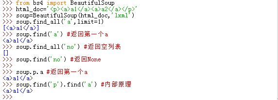

### 4. 其他搜索`find*()`方法


- `find_parents( name , attrs , recursive , text , **kwargs )`与
  `find_parent( name , attrs , recursive , text , **kwargs )`：
  参数与`find_all()`相同，别在于搜索文档的不同部分。`find_parents()`搜索当前节点的父辈节点然后过滤出所有符合条件的父辈节点。`find_parent`搜索当前节点的父辈节点然后过滤出第一个符合条件的父辈节点。搜索父辈节点的方法实际上就是对`.parents`属性的迭代搜索。

- `find_next_siblings( name , attrs , recursive , text , **kwargs )`与
  `find_next_sibling( name , attrs , recursive , text , **kwargs )`：
  参数与`find_all()`相同，区别在于搜索文档的不同部分。`find_next_siblings()`
  搜索当前节点的后面的兄弟节点然后过滤出符合条件的所有后兄弟节点。`find_next_sibling`只返回符合条件的后面兄弟节点中第一个符合条件的节点。搜索后兄弟节点的方法实际上就是对 `.next_siblings` 属性的迭代搜索。

- `find_previous_siblings( name , attrs , recursive , text , **kwargs )`与
  `find_previous_sibling( name , attrs , recursive , text , **kwargs )`：
  参数与`find_all()`相同，区别在于搜索文档的不同部分。`find_previous_siblings()`
  搜索当前节点的前面的兄弟节点然后过滤出符合条件的前兄弟节点。`find_previous_sibling`只返回符合条件的前兄弟节点中第一个符合条件的节点。搜索前兄弟节点的方法实际上就是对 `.previous_siblings` 属性的迭代搜索。

- `find_all_next( name , attrs , recursive , text , **kwargs )`与
  `find_next( name , attrs , recursive , text , **kwargs )`：
  参数与`find_all()`相同，区别在于搜索文档的不同部分。`find_all_next()`
  搜索当前节点的后面解析的节点然后过滤出符合条件的后解析节点。`find_next`只返回符合条件的所有后解析结点中第一个符合条件的结点。搜索后解析节点的方法实际上就是对 `.next_elements ` 属性的迭代搜索

- `find_all_previous( name , attrs , recursive , text , **kwargs )`与
  `find_previous( name , attrs , recursive , text , **kwargs )`：
  参数与`find_all()`相同，区别在于搜索文档的不同部分。`find_all_previous()`
  搜索当前节点的前面解析的节点然后过滤出符合条件的前解析节点。`find_previous`只返回符合条件的所有前解析结点中第一个满足条件的结点。搜索前解析节点的方法实际上就是对 `.previoust_elements ` 属性的迭代搜索

> `find_all( name , attrs , recursive , text , **kwargs )`与`find( name , attrs , recursive , text , **kwargs )`只在当前节点的子孙结点中搜索（注意并不搜索本节点本身）。

  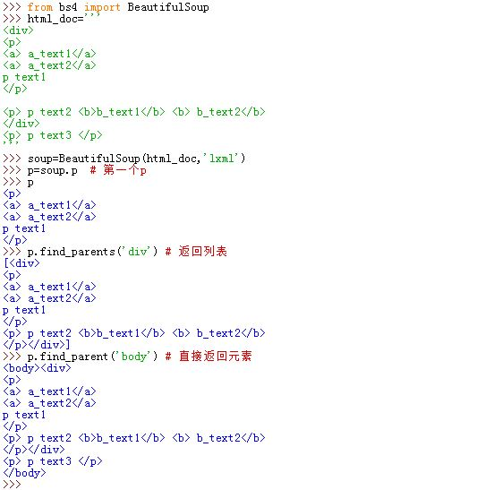

### 5. CSS选择器

在`Tag`和`BeautifulSoup`对象的`.select()`方法中传入字符串参数即可使用CSS选择器的语法找到`Tag`。
下面的示例是常见的CSS选择器：

```
soup.select('p') # 通过标签查找，选择所有的p
soup.select('.cls') #通过CSS类名查找，选择class=cls
soup.select('#id1') #通过`id=id1`查找
soup.select('div,p') #查找所有的div和p
soup.select('div p') #查找div内部的所有的p
soup.select('div>p') #查找直系父元素为div的所有的p
soup.select('div+p') #查找紧接在div之后的所有p
soup.select('[target]') #查找所有带target属性的元素
soup.select('[target=_blank]') #查找所有target='_blank'的元素
```
<table class="dataintable">
<tr>
<th>选择器</th>
<th>例子</th>
<th>例子描述</th>
</tr>

<tr>
<td>.<i>class</i></td>
<td>.intro</td>
<td>选择 class=&quot;intro&quot; 的所有元素。</td>
</tr>

<tr>
<td>#<i>id</i></td>
<td>#firstname</td>
<td>选择 id=&quot;firstname&quot; 的所有元素。</td>
</tr>

<tr>
<td>*</td>
<td>*</td>
<td>选择所有元素。</td>
</tr>

<tr>
<td><i>element</i></td>
<td>p</td>
<td>选择所有 &lt;p&gt; 元素。</td>
</tr>

<tr>
<td><i>element</i>,<i>element</i></td>
<td>div,p</td>
<td>选择所有 &lt;div&gt; 元素和所有 &lt;p&gt; 元素。</td>
</tr>

<tr>
<td><i>element</i> <i>element</i></td>
<td>div p</td>
<td>选择 &lt;div&gt; 元素内部的所有 &lt;p&gt; 元素。</td>
</tr>

<tr>
<td><i>element</i>&gt;<i>element</i></td>
<td>div&gt;p</td>
<td>选择父元素为 &lt;div&gt; 元素的所有 &lt;p&gt; 元素。</td>
</tr>

<tr>
<td><i>element</i>+<i>element</i></td>
<td>div+p</td>
<td>选择紧接在 &lt;div&gt; 元素之后的所有 &lt;p&gt; 元素。</td>
</tr>

<tr>
<td>[<i>attribute</i>]</td>
<td>[target]</td>
<td>选择带有 target 属性所有元素。</td>
</tr>

<tr>
<td>[<i>attribute</i>=<i>value</i>]></td>
<td>[target=_blank]</td>
<td>选择 target=&quot;_blank&quot; 的所有元素。</td>
</tr>

<tr>
<td>[<i>attribute</i>~=<i>value</i>]</td>
<td>[title~=flower]</td>
<td>选择 title 属性包含单词 &quot;flower&quot; 的所有元素。</td>
</tr>

<tr>
<td>[<i>attribute</i>|=<i>value</i>]</td>
<td>[lang|=en]</td>
<td>选择 lang 属性值以 &quot;en&quot; 开头的所有元素。</td>
</tr>

<tr>
<td>:link</td>
<td>a:link</td>
<td>选择所有未被访问的链接。</td>
</tr>

<tr>
<td>:visited</td>
<td>a:visited</td>
<td>选择所有已被访问的链接。</td>
</tr>

<tr>
<td>:active</td>
<td>a:active</td>
<td>选择活动链接。</td>
</tr>

<tr>
<td>:hover</td>
<td>a:hover</td>
<td>选择鼠标指针位于其上的链接。</td>
</tr>

<tr>
<td>:focus</td>
<td>input:focus</td>
<td>选择获得焦点的 input 元素。</td>
</tr>

<tr>
<td>:first-letter</td>
<td>p:first-letter</td>
<td>选择每个 &lt;p&gt; 元素的首字母。</td>
</tr>

<tr>
<td>:first-line</td>
<td>p:first-line</td>
<td>选择每个 &lt;p&gt; 元素的首行。</td>
</tr>

<tr>
<td>:first-child</td>
<td>p:first-child</td>
<td>选择属于父元素的第一个子元素的每个 &lt;p&gt; 元素。</td>
</tr>

<tr>
<td>:before</td>
<td>p:before</td>
<td>在每个 &lt;p&gt; 元素的内容之前插入内容。</td>
</tr>

<tr>
<td>:after</td>
<td>p:after</td>
<td>在每个 &lt;p&gt; 元素的内容之后插入内容。</td>
</tr>

<tr>
<td>:lang(<i>language</i>)</td>
<td>p:lang(it)</td>
<td>选择带有以 &quot;it&quot; 开头的 lang 属性值的每个 &lt;p&gt; 元素。</td>
</tr>

<tr>
<td><i>element1</i>~<i>element2</i></td>
<td>p~ul</td>
<td>选择前面有 &lt;p&gt; 元素的每个 &lt;ul&gt; 元素。</td>
</tr>

<tr>
<td>[<i>attribute</i>^=<i>value</i>]</td>
<td>a[src^=&quot;https&quot;]</td>
<td>选择其 src 属性值以 &quot;https&quot; 开头的每个 &lt;a&gt; 元素。</td>
</tr>

<tr>
<td>[<i>attribute</i>$=<i>value</i>]</td>
<td>a[src$=&quot;.pdf&quot;]</td>
<td>选择其 src 属性以 &quot;.pdf&quot; 结尾的所有 &lt;a&gt; 元素。</td>
</tr>

<tr>
<td>[<i>attribute</i>*=<i>value</i>]</td>
<td>a[src*=&quot;abc&quot;]</td>
<td>选择其 src 属性中包含 &quot;abc&quot; 子串的每个 &lt;a&gt; 元素。</td>
</tr>

<tr>
<td>:first-of-type</td>
<td>p:first-of-type</td>
<td>选择属于其父元素的首个 &lt;p&gt; 元素的每个 &lt;p&gt; 元素。</td>
</tr>

<tr>
<td>:last-of-type</td>
<td>p:last-of-type</td>
<td>选择属于其父元素的最后 &lt;p&gt; 元素的每个 &lt;p&gt; 元素。</td>
</tr>

<tr>
<td>:only-of-type</td>
<td>p:only-of-type</td>
<td>选择属于其父元素唯一的 &lt;p&gt; 元素的每个 &lt;p&gt; 元素。</td>
</tr>

<tr>
<td>:only-child</td>
<td>p:only-child</td>
<td>选择属于其父元素的唯一子元素的每个 &lt;p&gt; 元素。</td>
</tr>

<tr>
<td>:nth-child(<i>n</i>)</td>
<td>p:nth-child(2)</td>
<td>选择属于其父元素的第二个子元素的每个 &lt;p&gt; 元素。</td>
</tr>

<tr>
<td>:nth-last-child(<i>n</i>)</td>
<td>p:nth-last-child(2)</td>
<td>同上，从最后一个子元素开始计数。</td>
</tr>

<tr>
<td>:nth-of-type(<i>n</i>)</td>
<td>p:nth-of-type(2)</td>
<td>选择属于其父元素第二个 &lt;p&gt; 元素的每个 &lt;p&gt; 元素。</td>
</tr>

<tr>
<td>:nth-last-of-type(<i>n</i>)</td>
<td>p:nth-last-of-type(2)</td>
<td>同上，但是从最后一个子元素开始计数。</td>
</tr>

<tr>
<td>:last-child</td>
<td>p:last-child</td>
<td>选择属于其父元素最后一个子元素每个 &lt;p&gt; 元素。</td>
</tr>

<tr>
<td>:root</td>
<td>:root</td>
<td>选择文档的根元素。</td>
</tr>

<tr>
<td>:empty</td>
<td>p:empty</td>
<td>选择没有子元素的每个 &lt;p&gt; 元素（包括文本节点）。</td>
</tr>

<tr>
<td>:target</td>
<td>#news:target</td>
<td>选择当前活动的 #news 元素。</td>
</tr>

<tr>
<td>:enabled</td>
<td>input:enabled</td>
<td>选择每个启用的 &lt;input&gt; 元素。</td>
</tr>

<tr>
<td>:disabled</td>
<td>input:disabled</td>
<td>选择每个禁用的 &lt;input&gt; 元素</td>
</tr>

<tr>
<td>:checked</td>
<td>input:checked</td>
<td>选择每个被选中的 &lt;input&gt; 元素。</td>
</tr>

<tr>
<td>:not(<i>selector</i>)</td>
<td>:not(p)</td>
<td>选择非 &lt;p&gt; 元素的每个元素。</td>
</tr>

<tr>
<td>::selection</td>
<td>::selection</td>
<td>选择被用户选取的元素部分。</td>
</tr>
</table>

## 五、修改文档树

### 1. 修改`Tag`的名字和属性

我们可以重命名一个`Tag`，改变属性的值，添加或者删除属性。

```
tag=soup.b
tag.name='a_new_name'# 修改名字
tag['class']='new_cls'#修改class属性
tag['id']='new_id'  #修改ID属性
```

  

### 2. 修改 `Tag.string`

给`Tag.string`属性赋值，相当于用当前的内容体改了原来的内容。如`tag.string='New string here.'`

如果当前`Tag`已经包含了其他的`Tag`，那么给他的`.string`属性赋值会覆盖掉原有的所有内容包括子`Tag`。
>`NavigableString`也有一个`.string`属性，它是一个`str`类型，代表了该`NavigableString`存储的字符串。
> 但是这个属性是只读的。无法通过`NavigableString.string`的赋值来修改这个属性值。

  

### 3. 添加内容 `Tag.append()`

`Tag.append()`方法向`Tag`中添加字符串内容。它类似于`Python`列表中的`.append()`方法。

- 添加的字符串被初始化成`NavigableString`对象，然后添加到`Tag.contents`末尾。
- 如果添加的字符串含有`HTML`标记，则将该标记转义然后初始化成`NavigableString`对象，
  并不是将字符串解析成`Tag`结点。

  

> `.append()`的原理就是在`.contents`列表末尾添加元素。但是由于`NavigableString`并没有`.contents`属性，因此并不能执行`NavigableString.append()`。

### 4. 创建内容`BeautifulSoup.new_string()`和`BeautifulSoup.new_tag()`

- `BeautifulSoup.new_string()`:创建一个`NavigableString`。你也可以将`NavigableString`子类名作为第二个参数传入从而创建一个`NavigableString`的子类。
- `BeautifulSoup.new_tag()`：创建一个`Tag`。

创建完这些节点之后你可以调用`Tag.append()`添加到文档树中。
> 3中的`Tag.append()`只能直接添加`NavigableString`，而不能添加`Tag`对象

### 5. 插入内容

- `Tag.insert()`：将新元素插入到指定位置，而不是`.contents`属性的最后
- `Tag.insert_before()`或者`NavigableString.insert_before()`：在当前`Tag`或者文本节点之前插入内容
- `Tag.insert_after()`或者`NavigableString.insert_after()`：在当前`Tag`或者文本节点之后插入内容

> `.insert()`的原理就是在`.contents`列表指定位置添加元素。但是由于`NavigableString`并没有`.contents`属性，因此并不能执行`NavigableString.insert()`。

  

### 6. 清除内容

`Tag.clear()`会清除当前的`Tag`内容。（也就是清除了所有的子节点）
> `NavigableString`并没有`.clear()`方法

  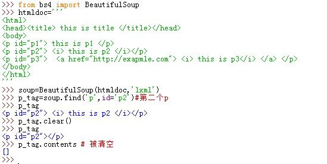

### 7. 移除节点

- `Tag.extract()`或者`NavigableString.extract()`：将本节点移除文档树并返回该节点。
- `Tag.decompose()`将本`Tag`移除文档树并销毁本节点（并不返回本节点）。
	> `NavigableString`并没有`.decompose()`方法

  

### 8. 替换节点

`Tag.replace_with()`或者`NavigableString.replace_with()`方法从文档树中移除本节点并用新的`Tag`或者`NavigableString`替代，它返回被替代的旧结点。

  

### 9. 包装与反包装节点

- `Tag.wrap()`或者`NavigableString.wrap()`方法对本节点进行包装并返回包装后的新结点.
- `Tag.unwrap()`方法与`.wrap()`相反，它移除`Tag`的标签，如`<b>xxx</b>`经过`.unwrap()`之后变成`xxx`。
	> `NavigableString`没有`.unwrap()`方法

  

## 六、输出

### 1. 格式化输出

`BeautifulSoup.prettify()`、`Tag.prettify()`会将文档树格式化后以字符串输出，每一个`XML/HTML`标签都独占一行。

### 2. 压缩输出

如果你只需要得到结果字符串而不重视格式，那么可以对`BeautifulSoup`或者`Tag`对象调用`.str()`方法，它默认采用`UTF-8`编码。当然你可以指定编码。

你也可以调用`.encode()`方法获取字节码或者调用`.decode()`方法获取字符串。

### 3. 获取文本

如果你只需要获取标签中的文本内容，则可以`BeautifulSoup`或者`Tag`对象调用`.get_text()`方法。该方法将获取到标签中包含的所有文字内容（包括子节点和孙节点及后代结点的文本内容），然后将结果作为字符串返回。

- 可以通过参数指定节点文本内容的分隔符，如`soup.get_text('|')`
- 可以去除文本内容前后空白，如`soup.get_text(strip=True)`
- 可以使用`.stripped_string`生成器，获取文本列表之后手动处理列表，
  如`[text for text in soup.stripped_strings]`

  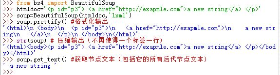

## 七、编码

任何`HTML`和`XML`文档都有自己的编码。通过`BeautifulSoup`解析之后，文档都被转换成`Unicode`字符串。


### 1. 编码自动检测
`BeautifulSoup`使用了"编码自动检测"子库来识别当前文档编码并且转换成`Unicode`编码。`BeautifulSoup`对象的`.original_encoding`属性记录了自动识别编码的结果（<font color='red'>经过测试，`.original_encoding`不是很准确</font>)。

"编码自动检测"大部分都能猜对编码格式，但是有时候会猜错。即使猜测正确，也是效率很慢。如果预先知道文档编码，可以设置编码参数来减少自动检测编码出错的概率并且提高文档解析速度。通过给`BeautifulSoup`构造函数提供`from_encoding`关键字参数达到目的：`soup=BeautifulSoup(html_doc,from_encoding='utf-8')`

  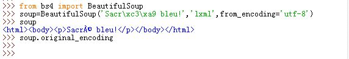

#### a. 独立使用编码自动检测

编码自动检测可以独立于`BeautifulSoup`使用。检测未知编码时可以用这种办法：

```
from bs4 import UnicodeDammit
dammit=UnicodeDammit(htmldoc)
print(dammit.unicode_markup) #编码后的字符串
dammit.original_encoding #编码
```

- 如果事先猜测一些可能的编码，那么可以将这些编码列表作为`UnicodeDammit`的构造参数。此时`UnicodeDammit`会优先检测这些编码。
- 如果Python中安装了`chardet`或者`cchardet`，那么编码检测功能的准确率会大大提高

  

#### b. 混合编码

如果文档的一部分使用某个编码，另一部分采用另一种编码，那么可以用`UnicodeDammit.detwingle()`方法将这类文档转换成纯`UTF-8`编码格式（使用时需先解码）。

```
from bs4 import UnicodeDammit
new_doc=UnicodeDammit.detwingle(doc)
print(new_doc.decode('utf8')
```

  

### 2. `Beautifulsoup.contains_replacement_characters`

- `Beautifulsoup.contains_replacement_characters`属性为`True`:表示`BeautifulSoup`将特殊字符替换成了`Unicode`特殊字符(`U+FFFD`），极有可能是由于`UTF-8`编码的文档包含了其他编码格式的字符
- `Beautifulsoup.contains_replacement_characters`属性设为`False`：表示结果中的`Unicode`特殊字符(`U+FFFD`）就是文档中原来的字符，而不是转码失败

### 3. 输出编码

`BeautifulSoup`的输出编码始终为`UTF-8`而不管输入编码方式是什么。如`soup.prettify()`

如果想指定编码方式，可以有以下几种方法：

- 将编码方式传入`.prettify()`方法，如：`soup.prettify('ascii')`
- 将编码方式传入`.encode()`方法，如：`soup.encode('ascii')`

如果文档中包含当前编码不支持的字符，那么将这些字符转换成一系列XML特殊字符引用

## 七、解析部分文档

如果仅仅需要查找文档中的`<a>`标签那么就没必要对整个文档进行解析，因为这浪费内存和时间。`SoupStrainer`类可以定义文档的某部分内容，这样搜索就可以只解析在`SoupStrainer`中定义过的内容，这称之为部分解析。

要执行部分解析，则需要给`BeautifulSoup`构造函数提供一个`parse_only`关键字参数，该参数的值是一个`SoupStrainer`实例。

`SoupStrainer`类的构造时，它接受的参数与典型的`BeautifulSoup.find_all()`方法相同的参数，包括：
`name`、`attrs`、`recursive`、`text`、`**kwargs`等。

  

## 八、常见问题

### 1. 代码诊断

如果想知道`BeautifulSoup`如何解析一份文档，可以用`bs4.diagnose.diagnose(htmldoc)`方法来查看。该方法会输出一份报告，说明不同的解析器会怎样处理这段文档，并标出当前的解析过程会使用哪种解析器。

  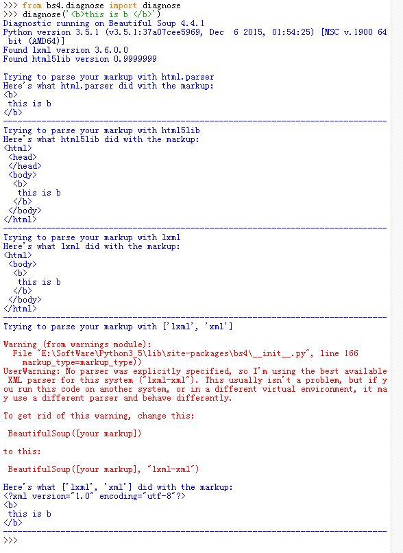

### 2. 文档解析错误

常见的文档解析错误是`HTMLParser.HTMLParseError`，这通常是解析器引起的。建议尽量不要使用内置解析器而采用`lxml`或者`html5lib`。

### 3. 提高解析效率

- 提高解析效率的方法：使用`lxml`作为解析器
- 安装`cchardet`之后文档的编码检测速度会更快
- 解析部分文档不会节省多少解析时间，但是会节省很多内存并且搜索时也会变得更快

