<!--
    作者：华校专
    email: huaxz1986@163.com
**  本文档可用于个人学习目的，不得用于商业目的  **
-->
# matplotlib笔记（基于 matplotlib 1.5.1 ）

## 一、matplotlib配置

matplotlib配置信息是从配置文件中读取的。在配置文件中可以为matplotlib几乎所有的属性指定永久有效的默认值。

### 1. 查看配置
你可以通过 `matplotlib.rcParams`字典访问所有已经加载的配置项

  

### 2. 修改配置

- 你可以通过 `matplotlib.rcParams`字典修改所有已经加载的配置项

  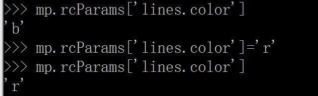 

- 你可以通过`matplotlib.rc(*args,**kwargs)`来修改配置项，其中`args`
  是你要修改的属性，`kwargs`是属性的关键字属性

  

- 你可以调用`matplotlib.rcdefaults()`将所有配置重置为标准设置。

  
  
### 3. 配置文件

如果不希望在每次代码开始时进行参数配置，则可以在项目中给出配置文件。配置文件有三个位置：
  
- 系统级配置文件。通常在python的`site-packages`目录下。每次重装`matplotlib`之后该配置文件就会被覆盖。
- 用户级配置文件。通常在`$HOME`目录下。可以用`matplotlib.get_configdir()`命令来查找当前用户的配置文件目录。

  
  
- 当前工作目录。即项目的目录。在当前目录下，可以为目录所包含的当前项目给出配置文件，文件名为`matplotlibrc`。

配置文件的内容常见的有以下几种：

- axes:设置坐标轴边界和表面的颜色、坐标刻度值大小和网格的显示
- backend：设置目标输出TkAgg和GTKAgg
- figure:控制dpi、边界颜色、图像大小和子区(`subplot`)设置
- font：字体(`font family`)、字体大小和样式设置
- grid:设置网格颜色和线型
- legend：设置图例以及其中的文本显示
- line：设置线条（颜色、线型、宽度等）和标记
- patch: 填充2D空间的图形图像，如多边形和圆。控制线宽、颜色和抗锯齿设置等。
- savefig:对保存的图形进行单独设置。如渲染的文件背景为白色。
- text：设置字体颜色、文本解析（纯文本和latex标记）等。
- verbose:设置matplotlib执行期间的信息输出，如silent、helpful、debug和debug--annoying
- xticks和yticks：为x、y轴的主刻度和次刻度设置颜色、大小、方向以及标签大小

## 二、 matplotlib Artist

`matplotlib`有三个层次的API：

- `matplotlib.backend_bases.FigureCanvas`：代表了一个绘图区，在这个绘图区上图表被绘制
- `matplotlib.backend_bases.Renderer`：代表了渲染器，它知道如何在绘图区上绘图。
- `matplotlib.artist.Artist`：代表了图表组件，它知道如何利用渲染器在绘图区上绘图。

通常用于有95%以上的时机都是与`matplotlib.artist.Artist`类打交道，它是高层次的绘图控制。

`matplotlib`中有两种`Artist`：

- `primitive`：代表了我们在绘图区域上绘制的基础的绘图组件，比如`Line2D`，`Rectangle`，`Text`
  以及`AxesImage`等等。
- `container`：代表了放置`primitive`的那些绘图组件。比如`Axis`、`Axes`以及`Figure`，如图所示

  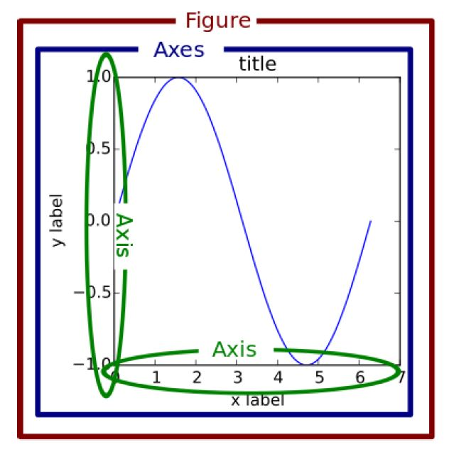

`matplotlib`的标准使用流程为：

- 创建一个`Figure`实例对象`fig`
- 使用`fig`实例创建一个或者多个`Axes`实例，或者创建一个或者多个`Subplot`实例
- 使用`Axes`实例的方法来创建`primitive`

### 1. Artist的属性

每个在图形中出现的元素都是`Artist`

- `Figure.patch`属性：是一个`Rectangle`，代表了图表的矩形框，它的大小就是图表的大小，
  并且可以通过它设置图表的背景色和透明度。
- `Axes.patch`属性：也是一个`Rectangle`，代表了绘图坐标轴内部的矩形框（白底黑边），
  通过它可以设置`Axes`的颜色、透明度等。
- 所有的`Artist`有下列属性。：
	- `.alpha`属性：透明度。值为0--1之间的浮点数
	- `.animated`属性：一个布尔值，表示是否用于加速动画绘制
	- `.axes`属性：返回这个`Artist`所属的`axes`，可能为`None`
	- `clip_box`属性：用于剪切`Artist`的`bounding box`
	- `clip_on`属性：是否开启`clip`
	- `clip_path`属性：`Artist`沿着该`path`执行`clip`
	- `contains`属性：一个`picking function`用于测试`Artist`是否包含`pick point`
	- `figure`属性：该`Artist`所属的`Figure`，可能为`None`
	- `gid`属性：该`Artist`的`id`字符串
	- `label`：一个`text label`
	- `picker`:一个`python object`用于控制`object picking`
	- `transform`：转换矩阵
	- `.url`属性：一个`url string`，代表本`Artist`
	- `visible`：布尔值，控制`Artist`是否绘制
	- `zorder`：决定了`Artist`的绘制顺序。`zorder`越小就越底层，则越优先绘制。
	>这些属性可以通过旧式的`setter`和`getter`函数访问和设置。如：
	>
	> - `o.get_alpha()`、`o.set_alpha(0.5)`
	> - 如果你想一次设置多个属性，也可以用：`o.set(alpha=0.5,zorder=2)`这种方式
	> - 你可以使用`matplotlib.artist.getp(o)`来一次获取`o`的所有属性
	>

  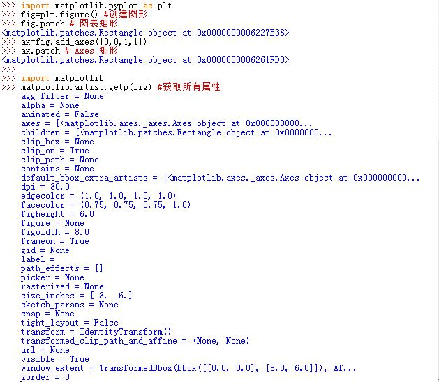

### 2. container Artist:

#### a. Figure 

`matplotlib.figure.Figure`是最顶层的`container Artist`，它包含了图表中的所有元素。

- `Figure.patch`属性：`Figure`的背景矩形
- `Figure.axes`属性：持有的一个`Axes`实例的列表（包括`Subplot`)
- `Figure.images`属性：持有的一个`FigureImages patch`列表
- `Figure.lines`属性：持有一个`Line2D`实例的列表（很少使用）
- `Figure.legends`属性：持有的一个`Figure Legend`实例列表（不同于`Axes.legends`)
- `Figure.patches`属性：持有的一个`Figure pathes`实例列表（很少使用)
- `Figure.texts`属性：持有的`Figure Text`实例列表

##### 1> Figure 的 Axes

当你执行`Figure.add_subplot()`或者`Figure.add_axes()`时，这些新建的`Axes`都被添加到`Figure.axes`列表中。

由于`Figure`维持了`current axes`，因此你不应该手动的从`Figure.axes`列表中添加删除元素，而是要通过`Figure.add_subplot()`、`Figure.add_axes()`来添加元素，通过`Figure.delaxes()`来删除元素。但是你可以迭代或者访问`Figure.axes`中的`Axes`，然后修改这个`Axes`的属性。

可以通过`Figure.gca()`获取`current axes`，通过`Figure.sca()`设置`current axes`。

##### 2> Figure 的 primitive

`Figure`也有它自己的`text`、`line`、`patch`、`image`。你可以直接通过`add primitive`语句直接添加。但是注意`Figure`默认的坐标系是以像素为单位，你可能需要转换成`figure`坐标系：(0,0)表示左下点，(1,1)表示右上点。

  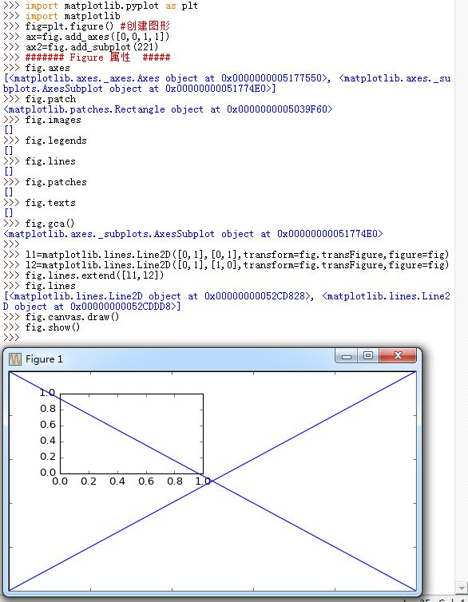

#### b. Axes类

`Axes`类是`matplotlib`的核心，你在大多数时间都是在与它打交道。`Axes`代表了`plotting area`。大量的用于绘图的`Artist`存放在它内部，并且它有许多辅助方法来创建和添加`Artist`给它自己，而且它也有许多赋值方法来访问和修改这些`Artist`。

它有许多方法用于绘图，如`.plot()`、`.text()`、`.hist()`、`.imshow()`等方法用于创建大多数常见的`primitive`(如`Line2D`，`Rectangle`，`Text`，`Image`等等）。这些方法会创建`primitive Artist`实例，并且添加这些实例到对应的`container`上去，然后必要的时候会绘制这些图形。

`Subplot`就是一个特殊的`Axes`，其实例是位于网格中某个区域的`Subplot`实例。其实你也可以在任意区域创建`Axes`，通过`Figure.add_axes([left,bottom,width,height])`来创建一个任意区域的`Axes`，其中`left,bottom,width,height`都是[0--1]之间的浮点数，他们代表了相对于`Figure`的坐标。

  

##### 1> .patch 属性

`Axes`包含了一个`.patch`属性，对于卡迪尔坐标系而言，它是一个`Rectangle`；对于极坐标而言，它是一个`Circle`。这个`.patch`属性决定了`plotting region`的形状、背景和边框。

 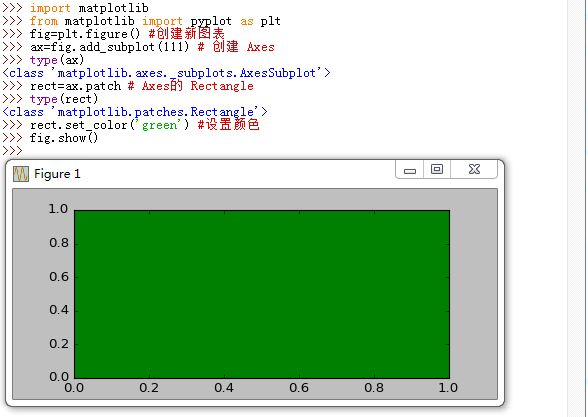

##### 2> 常用绘图方法

当调用`Axes.plot()`方法时，该方法会创建一个`matplotlib.lines.Line2D`实例，然后会利用传给`.plot()`的关键字参数来更新该`Line2D`的属性，然后将这个`Line2D`添加到`Axes.lines`列表中。该方法返回的刚创建的`Line2D`列表，因为你可以传递多个`(x,y)`值从而创建多个`Line2D`。

当调用`Axes.hist()`方法时，类似于`.plot()`方法，不过它会添加`patches`到`Axes.patches`列表。

  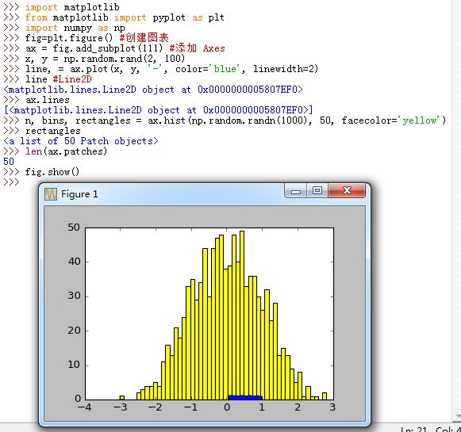

你不应该直接通过`Axes.lines`和`Axes.patches`列表来添加图表。因为当你通过`.plot()`和`.hist()`等方法添加图表时，`matplotlib`会做许多工作而不仅仅是添加绘图组件到`Axes.lines`或者`Axes.patches`列表中。

但是你可以使用`Axes`的辅助方法`.add_line()`和`.add_patch()`方法来添加。

  

##### 3> 常用 Axes 方法

下面是`Axes`用于创建`primitive Artist`以及添加他们到相应的`container`中的方法：

- `ax.annotate()`：创建`text annotation`（`Annotate`对象），然后添加到`ax.texts`列表中。
- `ax.bar()`：创建`bar chart`（`Rectangle`对象），然后添加到`ax.patches`列表中。
- `ax.errorbar()`：创建`error bar plot`（`Line2D`对象和`Rectangle`对象），然后添加到`ax.lines`
  列表中和`ax.patches`列表中。
- `ax.fill()`：创建`shared area`（`Polygon`对象），然后添加到`ax.patches`列表中
- `ax.hist()`：创建`histogram`（`Rectangle`对象），然后添加到`ax.patches`列表中。
- `ax.imshow()`：创建`image data`（`AxesImage`对象），然后添加到`ax.images`列表中。
- `ax.legend()`：创建`axes legends`（`Legend`对象），然后添加到`ax.legends`列表中。
- `ax.plot()`：创建`xy plot`（`Line2D`对象），然后添加到`ax.lines`列表中。
- `ax.scatter()`：创建`scatter charts`（`PolygonCollection`对象），然后添加到
  `ax.collections`列表中。
- `ax.text()`：创建`text`（`Text`对象），然后添加到`ax.texts`列表中。

##### 4>  Axes 的坐标轴
另外`Axes`还包含两个最重要的`Artist container`：

- `ax.xaxis`：`XAxis`对象的实例，用于处理`x`轴`tick`以及`label`的绘制
- `ax.yaxis`：`YAxis`对象的实例，用于处理`y`轴`tick`以及`label`的绘制

`Axes`包含了许多辅助方法来访问和修改`XAxis`和`YAxis`，这些辅助方法其实内部调用的是`XAxis`和`YAxis`的方法。因此通常情况下你不需要直接调用`XAxis`和`YAxis`的方法。

  

#### c. Axis类

`matplotlib.axis.Axis`实例处理`tick line`、`grid line`、`tick label`以及`axis label`的绘制。通常你可以独立的配置`y`轴的左边`tick`以及右边的`tick`，也可以独立地配置`x`轴的上边`tick`以及下边的`tick`。

`Axis`也存储了数据用于内部的缩放以及自适应处理。它还有`Locator`实例和`Formatter`实例用于控制`tick`摆放的位置以及`tick`的标注字符串。

每个`Axis`都有一个`.label`属性，也有`major tick`列表和`minor tick`列表。这些`tick`是`XTick`和`YTick`的实例，他们存放着实际的`line primitive`以及`text  primitive`来渲染`tick`以及`ticklabel`。

`tick`是动态创建的，只有在需要创建的时候才创建（比如缩放的时候）。`Axis`也提供了一些辅助方法来获取`tick label`、`tick location`等等：

- `Axis.get_major_ticks()`：获取`major tick`列表（一个`Tick`对象的列表）
- `Axis.get_minor_ticks()`：获取`minor tick`列表（一个`Tick`对象的列表）
- `Axis.get_ticklocs()`：获取`tick location`列表。
  可以通过`minor=True|False`关键字参数控制输出`minor`还是`major`的`tick location`。
- `Axis.get_ticklabels()`：获取`tick label`列表(一个`Text`实例的列表）。
  可以通过`minor=True|False`关键字参数控制输出`minor`还是`major`的`tick label`。
- `Axis.get_ticklines()`：获取`tick line`列表(一个`Line2D`实例的列表）。
  可以通过`minor=True|False`关键字参数控制输出`minor`还是`major`的`tick line`。
- `Axis.get_scale()`：获取坐标轴的缩放属性，如`'log'`或者`'linear'`
- `Axis.get_view_interval()`:获取内部的`axis view limits`实例
- `Axis.get_data_interval()`:获取内部的`axis data limits`实例
- `Axis.get_gridlines()`:获取`grid line`的列表
- `Axis.get_label()`:获取`axis label`(一个`Text`实例)
- `Axis.get_major_locator()`:获取`major tick locator`(一个`matplotlib.ticker.Locator`实例)
- `Axis.get_minor_locator()`:获取`minor tick locator`(一个`matplotlib.ticker.Locator`实例)
- `Axis.get_major_formatter()`:获取`major tick formatter`(一个`matplotlib.ticker.Formatter`实例)
- `Axis.get_minor_formatter()`:获取`minor tick formatter`(一个`matplotlib.ticker.Formatter`实例)
- `Axis.grid()`:一个开关，用于控制`major`或者`minor`的`tick`的`on|off`

  

#### d. Tick类

`matplotlib.axis.Tick`类是从`Figure`-->`Axes`-->`Tick`这个`container`体系中最末端的`container`。`Tick`容纳了`tick`、`grid line`以及`tick`对应的`label`。所有的这些都可以通过`Tick`的属性获取:

- `Tick.tick1line`：一个`Line2D`实例
- `Tick.tick2line`：一个`Line2D`实例
- `Tick.gridline`：一个`Line2D`实例
- `Tick.label1`：一个`Text`实例
- `Tick.label2`：一个`Text`实例
- `Tick.gridOn`：一个布尔值，决定了是否绘制`tickline`
- `Tick.tick1On`：一个布尔值，决定了是否绘制`1st tickline`
- `Tick.tick2On`：一个布尔值，决定了是否绘制`2nd tickline`
- `Tick.label1On`：一个布尔值，决定了是否绘制`1st tick label`
- `Tick.label2On`：一个布尔值，决定了是否绘制`2nd tick label`

> `y`轴分为左右两个，因此`tick1*`对应左侧的轴；`tick2*`对应右侧的轴。
> `x`轴分为上下两个，因此`tick1*`对应上侧的轴；`tick2*`对应下侧的轴。

  

### 3. primitive

#### a. Line2D类

`matplotlib.lines.Line2D`类是`matplotlib`中的曲线类（基类是`matplotlib.artist.Artist`），它可以有各种各样的颜色、类型、以及标注等等。它的构造函数为：

```
Line2D(xdata, ydata, linewidth=None, linestyle=None,
	color=None, marker=None, markersize=None, markeredgewidth
	=None, markeredgecolor=None, markerfacecolor
	=None, markerfacecoloralt=’none’, fillstyle=None,
	antialiased=None, dash_capstyle=None, solid_capstyle=None,
	dash_joinstyle=None, solid_joinstyle=None, pickradius=5,
	drawstyle=None, markevery=None, **kwargs)
```

这些关键字参数都是`Line2D`的属性。其属性有：

-  继承自`Artist`基类的属性：
 `.alpha`、`.animated`、`.axes`、`.clip_box`、.`.clip_on`、`.clip_path`、`.contains`、`.figure`、`.gid`、`.label`、`.picker`、`.transform`、`.url`、`.visible`、`.zorder`
- `.antialiased`或者`.aa`属性：一个布尔值。如果为`True`则表示线条是抗锯齿处理的
- `.color`或者`.c`属性：一个`matplotlib color`值，表示线条的颜色，
- `.dash_capstyle`属性：为`'butt' or 'round' or 'projecting'`，表示虚线头端类型
- `.dash_joinstyle`属性：为`'miter' or 'round' or 'bevel'`，表示虚线连接处类型
- `.dashes`属性：一个数值序列，表示虚线的实部、虚部的尺寸。如果为`(None,None)`则虚线成为实线
- `.drawstyle`属性：为`'default'or'steps'or'step-pre'or'step-mid'or'step-post'`，表示曲线类型。
	- `'default'`：点之间以直线连接
	- `'steps*'`：绘制阶梯图。其中`steps`等价于`steps-pre`，是为了保持兼容旧代码
- `.fillstyle`属性：为`'full'or'left'or'right'or'bottom'or'top'or'none'`表示`marker`的填充类型。
	- `'full'`：填充整个`marker`
	- `none`：不填充`marker`
	- 其他值：表示填充一半`marker`	
- `.linestyle`或者`ls`属性：指定线型，可以为以下值：
	- `'-'`或者`'solid'`：表示实线
	- `'--'`或者`dashed`：表示虚线
	- `'-.'`或者`dash_dot`：表示点划线
	- `':'`或者`'dotted'`：表示点线
	- `'None'`或者`' '`或者`''`：表示没有线条（不画线）
- `.linewidth`或者`lw`属性：为浮点值，表示线条宽度
- `.marker`属性：可以为一系列的字符串，如`'.'、','、'o'....`,表示线条的`marker`
- `.markeredgecolor`或者`.mec`属性:可以为`matplotlib color`，表示`marker`的边的颜色
- `.markeredgewidth`或者`.mew`属性:可以为浮点数，表示`marker`边的宽度
- `.markerfacecolor`或者`.mfc`属性：可以为`matplotlib color`，表示`marker`的前景色
- `.markerfacecoloralt`或者`.mfcalt`属性：可以为`matplotlib color`，表示`marker`的可选前景色
- `.markersize`或者`.ms`属性：可以为浮点数，表示`marker`的大小
- `.markevery`属性：指定每隔多少个点绘制一个`marker`，可以为以下值：
	- `None`：表示每个点都绘制`marker`
	- `N`：表示每隔`N`个点绘制`marker`，从0开始
	- `(start,N)`：表示每隔`N`个点绘制`marker`，从`start`开始
	- `[i,j,m,n]`：只有点`i,j,m,n`的`marker`绘制
	- ...其他值参考文档
- `.pickradius`属性：浮点值，表示`pick radius`
- `.solid_capstyle`属性：可以为`'butt'、'round'、'projecting'`，表示实线的头端类型
- `.sold_joinstyle`属性：可以为`'miter'、'round'、'bevel'`，表示实线连接处的类型
- `.xdata`属性：可以为一维的`numpy.array`，表示`x`轴数据
- `.ydata`属性：可以为一维的`numpy.array`，表示`y`轴数据


#### b. Text类

`matplotlib.text.Text`类是绘制文字的类（基类是`matplotlib.artist.Artist`）。它的构造函数为：

```
Text(x=0, y=0, text='', color=None, verticalalignment='baseline',
	horizontalalignment=’left’, multialignment=None, fontproperties
	=None, rotation=None, linespacing=None, rotation_
	mode=None, usetex=None, wrap=False, **kwargs)
```

这些关键字参数也是属性。其属性有：

-  继承自`Artist`基类的属性：
 `.alpha`、`.animated`、`.axes`、`.clip_box`、.`.clip_on`、`.clip_path`、`.contains`、`.figure`、`.gid`、`.label`、`.picker`、`.transform`、`.url`、`.visible`、`.zorder`
- `.backgroundcolor`属性：背景色，可以为任何`matplotlib color`
- `.bbox`属性：文本框的边框。其值是`FancyBboxPatch`类的属性字典。
- `.color`属性：字体颜色，可以为任何`matplotlib color`
- `.family`或者`.name`或者`.fontfamily`或者`.fontname`属性：字体的名字。可以是`string`或者`string list`（表示可以为若干个名字，优先级依次递减）。`string`必须是一个真实字体的名字，或者一个字体的`class name`。
- `.fontproperties`或者`.font_properties`属性：字体的属性，值是一个`matplotlib.font_manager.FontProperties`实例（该实例一次性设置字体的很多属性，比如字体类型、字体名字、字体大小、宽度、...）
- `.horizontalalignment`或者`.ha`属性：水平对齐方式，可以为`'center'、'right'、'left'`
- `.linespacing`属性：为浮点数，单位为`font size`，表示行间距
- `.multialignment`属性：`multiline text`对齐方式，可以为`'left'、'right'、'center'`
- `.position`属性：为一个元组`(x,y)`，表示文本框的位置
- `.rotation`属性：字体旋转角度。可以为下列值：
	- 浮点数，表示角度
	- `'vertical'、'horizontal'`
- `.rotation_mode`属性：旋转模式。可以为下列值：
	- `'anchor'`：文本首先对齐，然后根据对齐点来旋转
	- `None`：文本先旋转，再对齐
- `.size`或者`.fontsize`属性：字体大小。可以为下列值：
	- 浮点值，表示字体大小
	- `'xx-small'、'x-small'、'small'、'medium'、'large'、'x-large'、'xx-large'`
- `.stretch`或者`.fontstretch`属性：字体沿水平方向的拉伸。可以为下列值：
	- 整数，在[0---1000]之间
	- `'ultra-condensed'、'extra-condensed'、'condensed'、'semi-condensed'、'normal'、'semi-expanded'、'expanded'、'extra-expanded'、'ultra-expanded'`
- `.style`或者`.fontstyle`属性：字体样式，可以为`'normal'、'italic'、'oblique'`
- `.text`属性:文本字符串，可以为任意字符串（他可以包含`'\n'`换行符或者`LATEX`语法）
- `.variant`或者`.fontvariant`属性：表示字体形变，可以为下列值：`'normal'、'small-caps'`
- `.verticalalignment`或者`.ma`或者`.va`属性：表示文本的垂直对齐，可以为下列值：
	- `'center'、'top'、'bottom'、'baseline'`
- `.weight`或者`.fontweight`属性：设置字体的`weight`，可以为下列值：
	- 一个整数值，在[0---1000]之间
	- `'ultralight'、'light'、'normal'、'regular'、'book'、'medium'、
	'roman'、'semibold'、'demibold'、'demi'、'bold'、'heavy'、
	'extrabold'、'black'`
- `.x`属性：一个浮点值，表示文本框位置的`x`值
- `.y`属性：一个浮点值，表示文本框位置的`y`值

#### c. Annotation类

`matplotlib.text.Annotation`类是图表中的图式，它是一个带箭头的文本框，用于解说图表中的图形。它的基类是`matplotlib.text.Text`和` matplotlib.text._AnnotationBase`。其构造函数为：

```
Annotation(s, xy, xytext=None, xycoords=’data’, textcoords=None, arrowprops
	=None, annotation_clip=None, **kwargs)
```

在位置`xytext`处放置一个文本框，该文本框用于解释点`xy`，文本框的文本为`s`。

- `s`：文本框的文本字符串
- `xy`：被解释的点的坐标
- `xytext`：文本框放置的位置。如果为`None`，则默认取`xy`
- `xycoords`：`xy`坐标系，默认取`'data'`坐标系（即`xy`是数据坐标系中的点）。可以为以下值：
	- `'figure points'`：从`figure`左下角开始的点
	- `'figure pixesl'`：从`figure`左下角开始的像素值
	- `'figure fraction'`：`(0,0)`代表`figure`的左下角，`(1,1)`代表`figure`的右上角
	- `'axes points'`：从`axes`左下角开始的点
	- `'axes pixels'`：从`axes`左下角开始的像素
	- `'axes fraction'`：`(0,0)`代表`axes`的左下角，`(1,1)`代表`axes`的右上角
	- `'data'`：使用被标注对象的坐标系
	- `'offset points'`：指定从`xy`的便宜点
	- `'polar'`：极坐标系
- `textcoords`：文本框坐标系（即`xytext`是文本坐标系中的点），默认等于`xycoords`
- `arrowprops`：指定文本框和被解释的点之间的箭头。如果不是`None`，则是一个字典，该字典设定了`matplotlib.lines.Line2D`的属性。
	- 如果该字典有一个`arrowstyle`属性，则该键对应的值也是一个字典，创建一个`FancyArrowsPatch`实例，
	  实例属性由该字典指定。
	- 如果该字典没有`arrowstyle`属性，则创建一个`YAArrow`实例，
- `annotation_clip`：控制超出`axes`区域的`annotation`的显示。如果为`True`则`annotation`
  只显示位于`axes`区域内的内容。
- 额外的关键字参数全部是设置`Text`的属性

#### d. Legend

`matplotlib.legend.Legend`是图例类，它的基类是`matplotlib.artist.Artist`。其构造函数为：

```
Legend(parent, handles, labels, loc=None, numpoints=None, markerscale
	=None, markerfirst=True, scatterpoints=None,
	scatteryosets=None, prop=None, fontsize=None, borderpad
	=None, labelspacing=None, handlelength=None,
	handleheight=None, handletextpad=None, borderaxespad
	=None, columnspacing=None, ncol=1, mode=None,
	fancybox=None, shadow=None, title=None, framealpha
	=None, bbox_to_anchor=None, bbox_transform=None,
	frameon=None, handler_map=None)
```

其关键字参数为：

- `parent`：持有该`legend`的`artist`
- `loc`:图例的位置。其值可以为字符串或者数字：
	- `best`或0：自动计算
	- `upper right`或1： 右上角
	- `upper left`或2：上角
	- `lower left`或3：下角
	- `lower right`或4：右下角
	- `right`或5：右边
	- `center left`或6：中间偏左
	- `center right`或7：中间偏右
	- `lower center`或8：中间底部
	- `upper center`或9：中间顶部
	- `center`或10：正中央
- `handle`：一个`artist`列表，添加这些`artist`到`legend`中
- `lebels`：一个字符串列表添加到`legend`中
- `prop`:字体属性
- `fontsize`: 字体大小（只有`prop`未设置时有效）
- `markerscale`: `marker`的缩放比例（相对于原始大小）
- `markerfirst`: 如果为`True`，则`marker`放在`label`左侧；否则`marker`放在`label`右侧
- `numpoints`: the number of points in the legend for line
- `scatterpoints`: the number of points in the legend for scatter plot
- `scatteryosets`: a list of yosets for scatter symbols in legend
- `frameon`: if True, draw a frame around the legend. If None, use rc
- `fancybox`: if True, draw a frame with a round fancybox. If None, use rc
- `shadow`: if True, draw a shadow behind legend
- `framealpha`: If not None, alpha channel for the frame.
- `ncol`: number of columns
- `borderpad`: the fractional whitespace inside the legend border
- `labelspacing`: the vertical space between the legend entries
- `handlelength`: the length of the legend handles
- `handleheight`: the height of the legend handles
- `handletextpad`: the pad between the legend handle and text
- `borderaxespad`: the pad between the axes and legend border
- `columnspacing`:the spacing between columns
- `title`: 图例的标题
- `bbox_to_anchor`: the bbox that the legend will be anchored.
- `bbox_transform`: the transform for the bbox. transAxes if Noneloc a location code
- 其他关键字参数用于设置属性

属性为：

-  继承自`Artist`基类的属性：
 `.alpha`、`.animated`、`.axes`、`.clip_box`、.`.clip_on`、`.clip_path`、`.contains`、`.figure`、`.gid`、`.label`、`.picker`、`.transform`、`.url`、`.visible`、`.zorder`


#### e. Patch类

`matplotlib.patches.Patch`类是二维图形类。它的基类是`matplotlib.artist.Artist`。其构造函数为：

```
Patch(edgecolor=None, facecolor=None, color=None,
linewidth=None, linestyle=None, antialiased=None,
hatch=None, fill=True, capstyle=None, joinstyle=None,
**kwargs)
```

参数为：

- `edgecolor`：可以为`matplotlib color`，表示边线条的颜色，若为`none`则表示无颜色
- `facecolor`：可以为`matplotlib color`，表示前景色，若为`none`则表示无颜色
- `color`可以为`matplotlib color`，表示边线条和前景色的颜色。
- `linewidth`：为浮点数，表示线条宽度
- `linestyle`：指定线型，可以为以下值：
	- `'-'`或者`'solid'`：表示实线
	- `'--'`或者`dashed`：表示虚线
	- `'-.'`或者`dash_dot`：表示点划线
	- `':'`或者`'dotted'`：表示点线
	- `'None'`或者`' '`或者`''`：表示没有线条（不画线）
- `antialiased`：一个布尔值。如果为`True`则表示线条是抗锯齿处理的
- `hatch`：设置`hatching pattern`，可以为下列的值：
	- `'\'`、`'|'`、`'-'`、`'+'`、`'x'`、`'o'`、`'0'`、`'.'`、`'*'`
- `fill`：为布尔值。如果为`True`则填充图形，否则不填充
- `capstyle`：为`'butt' or 'round' or 'projecting'`，表示线条头端类型
- `joinstyle`：可以为`'miter'、'round'、'bevel'`，表示矩形线条接头类型
- 其他关键字参数用于设置属性

> 如果 `edgecolor, facecolor, linewidth, or antialiased` 为`None`则这些值从` rc params`中读取

属性如下：

-  继承自`Artist`基类的属性：
 `.alpha`、`.animated`、`.axes`、`.clip_box`、.`.clip_on`、`.clip_path`、`.contains`、`.figure`、`.gid`、`.label`、`path_eects`、`.picker`、`.transform`、`.url`、`.visible`、`.zorder`
- `.antialiased`或者`.aa`属性：一个布尔值。如果为`True`则表示线条是抗锯齿处理的
- `.capstyle`属性：为`'butt' or 'round' or 'projecting'`，表示线条头端类型
- `.color`属性：可以为`matplotlib color`，表示边线条和前景色的颜色。
- `.edgecolor`或者`.ec`属性：可以为`matplotlib color`，表示边线条的颜色，若为`none`则表示无颜色
- `.facecolor`或者`.fc`属性：可以为`matplotlib color`，表示前景色，若为`none`则表示无颜色
- `.fill`属性：为布尔值。如果为`True`则填充图形，否则不填充
- `.hatch`属性：设置`hatching pattern`，可以为下列的值：
	- `'\'`、`'|'`、`'-'`、`'+'`、`'x'`、`'o'`、`'0'`、`'.'`、`'*'`
- `.joinstyle`属性：可以为`'miter'、'round'、'bevel'`，表示矩形线条接头类型
- `.linestyle`或者`.ls`属性：指定线型，可以为以下值：
	- `'-'`或者`'solid'`：表示实线
	- `'--'`或者`dashed`：表示虚线
	- `'-.'`或者`dash_dot`：表示点划线
	- `':'`或者`'dotted'`：表示点线
	- `'None'`或者`' '`或者`''`：表示没有线条（不画线）
- `.linewidth`或者`.lw`属性：为浮点数，表示线条宽度

#### f.  Rectangle 类

`matplotlib.patches.Rectangle`类是矩形类（基类是`matplotlib.patches.Patch`），其构造函数为：`Rectangle(xy,width,height,angle=0.0,**kwargs)`。
参数为：

- `xy`：矩形左下角坐标
- `width`：矩形宽度
- `height`：矩形高度
- 其他关键字参数用于设置属性

其属性有：

-  继承自`Artist`基类的属性：
 `.alpha`、`.animated`、`.axes`、`.clip_box`、.`.clip_on`、`.clip_path`、`.contains`、`.figure`、`.gid`、`.label`、`.picker`、`.transform`、`.url`、`.visible`、`.zorder`
- 继承自`Patch`基类的属性：
  `.antialiased`或者`.aa`、`.capstyle`、`.color`、`.edgecolor`或者`.ec`、`.facecolor`或者`.fc`、`.fill`、`.hatch`、`.joinstyle`、`.linestyle`或者`.ls`、`.linewidth`或者`.lw`属性

#### g. Polygon类

`matplotlib.patches.Polygon`类是多边形类。其基类是`matplotlib.patches.Patch`。其构造函数为：
`Polygon(xy, closed=True, **kwargs)`。参数为：

- `xy`是一个`N×2`的`numpy array`，为多边形的顶点。
- `closed`为`True`则指定多边形将起点和终点重合从而显式关闭多边形。
- 其他关键字参数用于设置属性

`Polygon`的属性有：

-  继承自`Artist`基类的属性：
 `.alpha`、`.animated`、`.axes`、`.clip_box`、.`.clip_on`、`.clip_path`、`.contains`、`.figure`、`.gid`、`.label`、`.picker`、`.transform`、`.url`、`.visible`、`.zorder`
- 继承自`Patch`基类的属性：
  `.antialiased`或者`.aa`、`.capstyle`、`.color`、`.edgecolor`或者`.ec`、`.facecolor`或者`.fc`、`.fill`、`.hatch`、`.joinstyle`、`.linestyle`或者`.ls`、`.linewidth`或者`.lw`属性

#### h. PolyCollection类

`matplotlib.collections.PolyCollection`是多边形集合类，其基类是`matplotlib.collections._CollectionWithSizes`。它的构造函数为：

`PolyCollection(verts, sizes=None, closed=True, **kwargs)`。

其关键字参数为：

- `verts`：一个顶点序列。每个顶点都由`xy元组`或者`xy数组`组成
- `sizes`：一个浮点数序列，依次指定每个顶点正方形的边长。如果序列长度小于顶点长度，则循环从序列头部再开始挑选
- `closed`：如果为`True`，则显式封闭多边形
- `edgecolors`: `collection`的边的颜色
- 其他关键字参数用于设置属性

下面为属性：
-  继承自`Artist`基类的属性：
 `.alpha`、`.animated`、`.axes`、`.clip_box`、.`.clip_on`、`.clip_path`、`.contains`、`.figure`、`.gid`、`.label`、`.picker`、`.transform`、`.url`、`.visible`、`.zorder`
- `.facecolors`: `collection`的前景色
- `.linewidths`: `collection`的边线宽
- `.antialiaseds`:抗锯齿属性，可以为`True`或者`False`
- `.offsets`: 设置`collection`的偏移
- `.norm`: 归一化对象
- `.cmap`:`color map`

## 三、基本概念

`matplotlib`被划分为不同的层次：

- `matplotlib.pyplot`模块：位于`matplotlib`的顶层，它是一个`state-machine environment`。该模块中的很多函数是用于给当前`Figure`的当前`Axes`添加`plot element`，比如`line`、`text`、`image`等。它非常类似于`Matlab`的用法。
- 下一层是面向对象的接口：在这一层`pyplot`只是用部分函数来创建`Figure`，然后通过该`Figure`显式的创建`Axes`，然后通过面向对象的接口在该`Axes`上添加图形。极端情况下用户可以完全抛弃`pyplot`而完全使用面向对象的接口。
> 对于非交互式绘图，官方文档推荐用`pyplot`创建`Figure`，然后使用面向对象接口来绘图。

### 1. 输入数据

`matplotlib`的所有`plotting function`期待输入`numpy.array`或者`numpy.ma.masked_array`类型的数据作为输入。某些长得像`numpy.array`的数据比如`numpy.matrix`类型的输入数据可能会导致`matplotlib`工作异常。如果确实需要使用`numpy.matrix`，你应该首先将它转换为`numpy.array`

### 2.  matplotlib 、 pyplot 、 pylab 的关系

- `matplotlib`：它是整个`package`
- `matplotlib.pyplot`：是`matplotlib`的一个`module`。它为底层的面向对象接口提供了一个`state-machine interface`。这个`state-machine`必要的时候隐式创建`Figure`和`Axes`，并维护`current Figure`和`current Axes`
- `pylab`是一个便利的`module`，它导入了`matplotlib.pyplot`以及`numpy`，它只是为了`plot`以及`math`方便而用。官方文档不推荐使用它。

### 3. 代码风格

官方文档不推荐 `MATLAB`风格的代码。因为`MATLAB`风格代码维护了全局状态，你执行同一个`plot`多次可能会发现结果是不同的。
官方文档推荐使用如下风格：

```
import matplotlib.pyplot as plt
import numpy as np
fig=plt.figure()
ax=fig.add_subplot(111)
ax.plot(...)
ax.show()
```

这样的风格使得在绘图事件中，每个角色都很清楚，数据的流动也很清楚。

### 4.  backend 

`matplotlib`可以适用于非常广泛的场景：

- `matplotlib`可以交互式地用于`python shell`
- `matplotlib`可以嵌入到`wxpython`或者`pygtk`等`GUI`程序中
- `matplotlib`可以在脚本中使用从而生成`postscript image`

为了适应于这些场景，`matplotlib`针对这些`target`生成不同的输出格式。这种能力称之为`backend`。
> 与之相对的`frontend`指的是用户使用`matplotlib`而编写的代码

有两种类型的`backend`：

- 交互式的`backend`：应用于`pygtk`、`wxpython`、`tkinter`、`qt4`、`macosx`等中
- 非交互式的`backend`：用于生成`image file`（如`PNG、SVG、PDF、PS`等格式文件，这些`backend`的名字暗示了要存储的文件的格式）

有多种方法来设置`backend`，其中后面提到的方法会覆盖前面的方法设置的`backend`

- 在`matplotlibrc`配置文件中设置的`backend`参数，如`backend: WXAgg  #使use wxpython with antigrain(agg) rendering`
- 设置`MPLBACKEND`环境变量，无论是在`shell`中设置还是在脚本中设置。
- 对单个脚本设置`backend`时，可以直接在`python`命令后添加`-d`命令（这种方法不推荐，`deprecated`）
- 在脚本中使用特定的`backend`时，可以用`matplotlib.use('PDF')`命令。这条语句必须在`import matplotlib.pyplot`语句之前执行。如果在`import matplotlib.pyplot`之后执行`use`语句，则没有任何效果。通常建议避免使用`use()`方法，因为使用该脚本的人无法修改`backend`了。

> - 设定`backend`时，是忽略大小写的。因此`GTKAgg`也等价于`gtkagg`
>
> - 查看当前的`backend`可以用：`matplotlib.get_backend()`

#### a.  rendering engine 

`matplotlib`提供的常用的`rendering engine`是`Agg`，它采用的是`Anti-Grain Geometry C++ library`。除了`macosx`之外的所有`user interface`都可以用`agg rendering`，如`WXAgg,GTKAgg,QT4Agg,TkAgg`这些`backend`。
某些`user interface`还支持其他引擎，如`GTK`支持`Cario`引擎，如`GTKCariro backend`。 

下面是所有的`Rendering engine`：

- `AGG`：输出`png`格式文件。它可以输出高质量的图形
- `PS`：输出`ps\eps`格式文件。它是`Postscript output`
- `PDF`：输出`pdf`格式文件。
- `SVG`：输出`svg`格式文件
- `Cairo`：可以输出`png、ps、pdf、svg...`等格式文件
- `GDK`：可以输出`png、jpg、tiff...`等格式文件，它使用`Gimp Drawing Kit`

>要想保存成指定类型文件，如`PDF`，那么首先要设置合适的`backend`，

### 5. 交互式模式

使用交互式`backend`可以`plotting to the screen`，但是前提是`matplotlib`必须是`interactive mode`。

你可以在`matplotlibrc`配置文件中设置`matplotlib`是否位于交互模式，也可以通过代码`matplotlib.interacite()`来设置`matplotlib`位于交互模式。你可以通过代码`matplotlib.is_interactive()`来判断代码是否交互模式。通常并不建议在绘图过程中修改交互模式，因此要提前修改交互模式再绘图。

> 交互模式也可以通过`matplotlib.pyplot.ion()`开启交互模式，由`matplotlib.pyplot.ioff()`关闭交互模式。另外交互模式支持`ipython`和`python shell`，但是不支持`IDLE IDE`。

  

在交互模式下：

- `pyplot.plot()`绘图之后图表马上显示，`pyplot`自动绘制到屏幕，不需要调用`pyplot.show()`
- 图表显式之后你可以继续输入命令。任何对图形的修改会实时的反应到图表中去。
- 使用面向对象的方法，如`Axes`的方法并不会自动调用`draw_if_interactive()`。如果你通过`Axes`来修改图表，想更新图表的话那么你需要手动调用`.draw()`方法。而`pyplot`模块中的函数会主动调用`draw_if_interactive()`,因此如果你是通过`pyplot`模块修改图表那么不需要手动调用`.draw()`方法就是实时绘制。

在非交互模式下：

- 在绘图之后必须手动调用`pyplot.show()`才能显示图表。该函数会阻塞执行直到你关闭了图表窗口。
- 所有的绘制工作会延迟到`pyplot.show()`函数调用
- 在1.0版本以前，单个脚本文件中只能调用一次`pyplot.show()`，在1.01版本之后该限制被放松。

### 6. matplotlib的颜色
可以通过`matplotlib.pyplot.colors()`方法获取`matplotlib`支持的所有颜色。该方法不做任何事情，就是提供一个帮助文档。

`matplotlib`提供了下面颜色的别名：`'b'`：蓝色；`'g'`：绿色；`'r'`：红色；`'y'`：黄色；`'c'`：青色；`'k'`：黑色；`'m'`：洋红色；`'w'`：白色。

你也可以定制自己的颜色。有两种方法：

- 使用HTML十六进制字符串：如`'#eeefff'`
- 使用HTML颜色名字：如`'red'`
- 使用一个归一化到闭区间[0-1]的RGB元组：如`color=(0.3,0.3,0.4)`

> 在创建`Axes`或者`SubPlot`时，可以给构造函数提供一个`axisbg`参数来指定背景色

## 四、布局

### 1. 简单布局

简单布局通过`Figure.add_subplot(*args,**kwargs)`方法来完成，它返回的是`Axes`实例。当然你也可以通过`pyplot.subplot(*args,**kwargs)`函数来完成，他返回的也是`Axes`实例，该函数只是一个便利函数。
>`SubPlot`类是`Axes`类的子类。因此`SubPlot`对象也是`Axes`对象。

#### a. 典型用法

最典型用法是`matplotlib.pyplot.subplot(nrows,ncols,plot_number)`。`nrows`和`ncols`将图表划分成`nrows*ncols`大小的网格区域，每一个区域都能存放一个`SubPlot`；该函数创建`plot_number`位置处的`SubPlot-axes`。其中`plot_number`起始于1，最大值为`nrows*ncols`。

如果`nrows`、`ncols`、`plot_number`都是个位数，则你可以指定一个三位数来简化函数调用`matplotlib.pyplot.subplot(integer)`，其中百分位代表`nrows`，十分位代表`ncols`，各位代表`plot_number`。

#### b. 参数

- `axisbg`关键字参数：指定`subplot`的背景色
- `polar`关键字参数：指定`subplot`是否是极坐标。默认为`False`
- `projection`：
- `sharex`关键字参数：指定`subplot`与其他`Axes`(由该参数值指定）共享`xaxis attribute`
- `sharey`关键字参数：指定`subplot`是否与其他`Axes`(由该参数值指定）共享`yaxis attribute`

#### c.  pyplot.subplots() 函数

你可以通过`pyplot.subplots()`函数一次性的创建多个`SubPlot`。
>`pyplot.subplot()`每次只会创建一个`SubPlot`。

  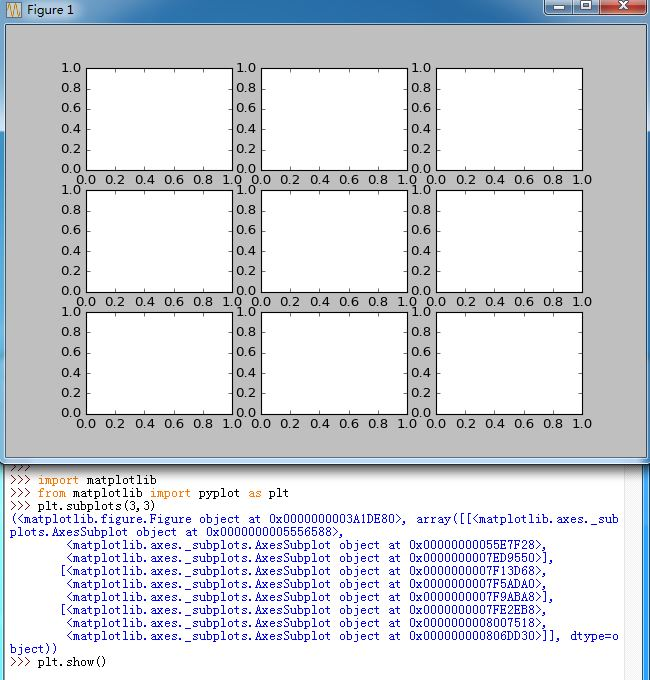

其参数有：

- `nrows`：行数，默认为1
- `ncols`：列数，默认为1
- `sharex`：
	- 如果为`True`，则所有`SubPlot`的`X axis`被共享。此时只有最后一行的`X`轴可见。
	- 如果为`False`，则`SubPlot`的`X axis`不共享，每一个`SbuPlot`的`X`轴可见。
	- 如果为字符串`all`，则等效于`True`
	- 如果为字符串`none`，则当小于`False`
	- 如果为字符串`row`，则每一行的`SubPlot`共享一个`X`轴（与`False`等效）
	- 如果为字符串`col`，则每一列的`SubPlot`共享一个`X`轴（与`True`等效）

  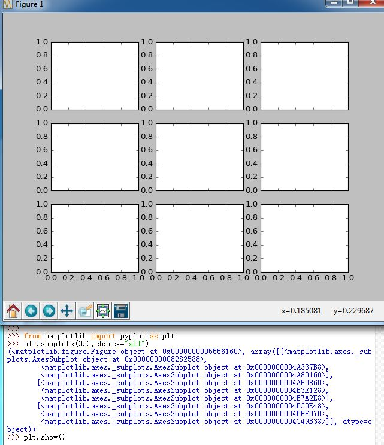

  

  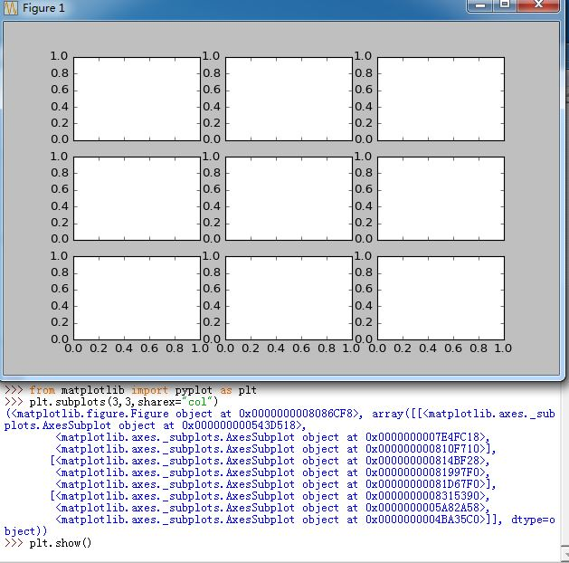

- `sharey`：
	- 如果为`True`，则所有`SubPlot`的`Y axis`被共享。此时只有第一列的`Y`轴可见。
	- 如果为`False`，则`SubPlot`的`Y axis`不共享，每一个`SbuPlot`的`Y`轴可见。
	- 如果为字符串`all`，则等效于`True`
	- 如果为字符串`none`，则当小于`False`
	- 如果为字符串`row`，则每一行的`SubPlot`共享一个`Y`轴（与`True`等效）
	- 如果为字符串`col`，则每一列的`SubPlot`共享一个`Y`轴（与`False`等效）
- `squeeze`：
	- 如果为`True`：
		- 如果只创建了一个`SubPlot`，则返回一个变量（创建的SubPlot对象)
		- 如果创建了`N*1`或者`1*N`个`SubPlot`，则返回一个1维向量
		- 如果创建了`N*M`个`SubPlot`（其中`N>1`,`M>1`），则返回一个2维向量
	- 如果为`False`则始终返回一个2维向量
- `subplot_kw`：一个字典参数，用于传递给`Axes.add_subplot()`来创建`SubPlot`
- `gridspec_kw`：一个字典参数，用于传递给`GridSpec`构造函数来创建`SubPlot`存放的网格
- `fig_kw`：一个字典参数，用于传递给`pyplot.figure()`函数。所有前述未能识别的感激案子参数都会传到这里。

其返回值为`figure,ax`。其中`figure`是一个`Figure`对象；`ax`取决于`squeeze`参数。

### 2. 使用 pyplot.subplot2grid() 函数

使用`pyplot.subplot2grid()`函数时，你只需要提供网格形状以及`SubPlot`位置即可，如：
`ax=pyplot.subplot2grid((2,2),(0,0))`，它等价于`ax=pyplot.subplot(2,2,1)`。其中`subplot2grid()`的位置坐标从0开始。

`subplot2grid()`支持`SubPlot`横跨或者纵跨多个单元格。`colspan`关键字参数指定纵向的跨度；`rowspan`guan尖子参数指定横向的跨度。

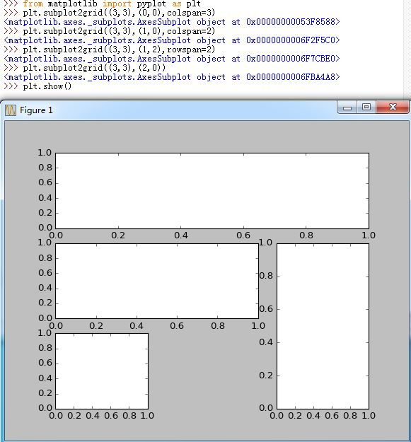

### 3. 使用 GridSpec 和 SubplotSpec 

你可以直接创建`matplotlib.gridspec.GridSpec`然后通过它来创建`SubPlot`。如：

```
gs=matplotlib.gridspec.GridSpec(2,2) #网格2行2列
matplotlib.pyplot.subplot(gs[0,0])
```

等价于`matplotlib.pyplot.subplot2grid((2,2),(0,0))

`GridSpec`对对象提供了类似`array`的索引方法，其索引的结果是一个`SubplotSpec`对象实例。如果你想创建横跨多个网格的`SubplotSpec`，那么你需要对`GridSpec`对象执行分片索引，如`pyplot.subplot(gs[0,:-1])`。

  

#### a. 调整 GridSpec layout 

如果你使用`GridSpec`，那么你可以调整由`GridSpec`创建的`SubplotSpec`的`layout parameter`。如：

```
gs=gridspec.GridSpec(3,3)
gs.update(left=0.05,right=0.48,wspace=0.05)
```

这种用法类似于`subplots_adjust`，但是它仅仅影响由本`GridSpec`创建的`SubplotSpec`。其中`gs.update()`的关键字参数有：

- `left`关键字参数：`subplot`左侧宽度
- `right`关键字参数：`subplot`右侧宽度
- `bottom`关键字参数：`subplot`底部高度
- `top`关键字参数：`subplot`顶部高度
- `wspace`关键字参数：`subplot`之间的空白宽度
- `hspace`关键字参数：`subplot`之间的空白的高度

#### b. 从 SubplotSpec 创建 GridSpec ：

你可以从`SubplotSpec`创建`GridSpec`。此时`layout parameter`由该`SubplotSpec`指定。如：

```
gs0=gridspec.GridSpec(1,2)
gs00=gridspec.GridSpecFromSubplotSpec(3,3,subplot_spec=gs0[0])
```

`matplotlib.gridspec.GridSpecFromSubplotSpec(nrows, ncols, subplot_spec,
wspace=None, hspace=None,height_ratios=None,width_ratios=None)`：创建一个`GridSpec`，它的`subplot layout parameter`继承自指定的`SubplotSpec`。其中`nrows`为网格行数，`ncols`为网格列数，`subplot_spec`为指定的`SubplotSpec`。

  

#### c. 创建不同大小的 GridSpec 网格

默认情况下，`GridSpec`创建的网格都是相同大小的。当然你可以调整相对的高度和宽度。注意这里只有相对大小（即比例）是有意义的，绝对大小值是没有意义的。如：

```
gs=gridspec.GridSpec(2,2,width_ratios=[1,2],height_ratios=[4,1]
plt.subplot(gs[0]
....
```

这里`width_ratios`关键字参数指定了一行中，各列的宽度比例（有多少列就有多少个数字）；
`height_ratios`关键字参数指定了一列中，各行的高度比例（有多少行就有多少个数字）。

  

#### d.  GridSpec.tight_layout() 

`GridSpec.tight_layout(fig, renderer=None, pad=1.08, h_pad=None, w_pad=None, rect=None)`:`tight_layout`能够自动调整`subplot param`从而使得`subplot`适应`figure area`。它仅仅检查`ticklabel、axis label、title`等内容是否超出绘制区域。其参数为：

- `fig`关键字参数：`Figure`对象，图表。
- `pad`关键字参数：一个浮点数，单位是`fontsize`，表示`figure edge` 和 `edges of subplots`之间的填充区域。
- `h_pad`关键字参数：一个浮点数，单位是`fontsize`，示`subplots`之间的高度，默认为`pad`。
- `w_pad`关键字参数：一个浮点数，单位是`fontsize`，示`subplots`之间的宽度，默认为`pad`。
- `rect`关键字参数：如果给定了该参数为一个列表或元组（是一个矩形的四要素，分别代表左下角坐标，宽度，高度），则指定了网格的轮廓矩形，所有的`subplots`都位于该矩形中。其坐标系是`figure coordinate`，从`[0...1]`，如果没有提供该参数，则默认为`(0, 0, 1, 1)`。

当然你可以使用`matplotlib.pyplot.tight_layout()`来达到同样的效果。

  

## 五、  Path 

`matplotlib.patch`对象底层的对象就是`Path`。它的基本用法如下：

```
import matplotlib.pyplot as plt
from matplotlib.path import Path
import matplotlib.patches as patches
verts = [
(0., 0.), # left, bottom
(0., 1.), # left, top
(1., 1.), # right, top
(1., 0.), # right, bottom
(0., 0.), # ignored
]
codes = [Path.MOVETO,
Path.LINETO,
Path.LINETO,
Path.LINETO,
Path.CLOSEPOLY,
]
path = Path(verts, codes)
fig = plt.figure()
ax = fig.add_subplot(111)
patch = patches.PathPatch(path)
ax.add_patch(patch)
ax.set_xlim(-2,2)
ax.set_ylim(-2,2)
plt.show()
```
  

### 1. 创建和使用 PATH 

`PATH`对象的创建通过`matplotlib.path.Path(verts,codes)`创建，其中：

- `verts`：`PATH`的顶点。这些顶点必须构成一个封闭曲线。其中每个顶点必须指定`x`坐标和`y`坐标。
- `codes`：指示如何使用这些`PATH`顶点。它与`verts`关系是一一对应的。有如下指令：
	- `Path.STOP`：结束`path`的标记
	- `Path.MOVETO`：画笔提起并移动到指定的顶点
	- `Path.LINETO`：画笔画直线，从`current position`到指定的顶点
	- `Path.CURVE3`:画笔画二阶贝塞尔曲线，从`current position`到指定的`end point`，
	  其中还有一个参数是指定的`control point`
	- `Path.CURVE4`：画笔画三阶贝塞尔曲线，从`current position`到指定的`end point`，
	  其中还有两个参数是指定的`control points`
	- `Path.CLOSEPOLY`：指定的`point`参数被忽略。该指令画一条线段，
	  从`current point`到`start point`

可以通过`matplotlib.patches.PathPatch(path)`来构建一个`PathPatch`对象，然后通过`Axes.add_patch(patch)`向`Axes`添加`PathPatch`对象.这样就添加了`Path`到图表中。

  

### 2.  Compound Path 

在`matplotlib`中所有简单的`patch primitive`，如`Rectangle`、`Circle`、`Polygon`等等，都是由简单的`Path`来实现的。而创建大量的`primitive`的函数如`hist()`和`bar()`（他们创建了大量的`Rectanle`）可以使用一个`compound path`来高效地实现。
> 但是实际上`bar()`创建的是一系列的`Rectangle`，而没有用到`compound path`，这是由于历史原因，是历史遗留问题。（`bar()`函数先于`Coupound Path`出现）

下面是一个`Compound Path`的例子：

```
... 
verts = np.zeros((nverts, 2))  # nverts为顶点的个数加1（一个终止符）
codes = np.ones(nverts, int) * Path.LINETO
## 设置 codes :codes分成5个一组，
## 每一组以Path.MOVETO开始，后面是3个Path.LINETO，最后是Path.CLOSEPOLY 
codes[0::5] = Path.MOVETO
codes[4::5] = Path.CLOSEPOLY
## 设置顶点 verts ##
...
## 创建 Path 、PathPatch并添加  ##
barpath = Path(verts, codes)
patch = patches.PathPatch(barpath, facecolor='green',edgecolor='yellow', alpha=0.5)
fig = plt.figure()
ax = fig.add_subplot(111)
ax.add_patch(patch)
ax.show()
```

## 六、 path effect 

`matplotlib`的`patheffects`模块提供了一些函数来绘制`path effect`，该模块还定义了很多`effect`类。可以应用`path effect`的`Artist`有：`Patch`、`Line2D`、`Collection`以及`Text`。每个`Artist`的`path effect`可以通过`.set_path_effects()`方法控制，其参数是一个可迭代对象，迭代的结果是`AbstractPathEffect`实例；也可以通过`Artist`构造函数的`path_effects=`关键字参数控制。

> 注意：`effect`类的关键字参数比如背景色、前景色等与`Artist`不同。因为这些`effect`类是更低层次的操作。

所有的`effect`类都继承自`matplotlib.patheffects.AbstractPathEffect`类。`AbstractPathEffect`的子类要覆盖`AbstractPathEffect`类的`.draw_path(...)`方法。

`AbstractPathEffect`类的构造函数有个`offset`关键字参数，表示`effect`偏移(默认为`(0,0)`)

### 1.  normal effect 

最简单的`effect`是`normal effect`，它是`matplotlib.patheffects.Normal`类。它简单的绘制`Artist`，不带任何`effect`。

如：

```
import matplotlib.pyplot as plt
import matplotlib.patheffects as path_effects
fig = plt.figure(figsize=(5, 1.5))
text = fig.text(0.5, 0.5, 'Hello path effects world!\nThis is the normal path effect.',
ha='center', va='center', size=20)
text.set_path_effects([path_effects.Normal()])
plt.show()
```

  

### 2.  drop-shadow effect 

我们可以在基于`Path`的`Artist`上应用`drop-shadow effect`（下沉效果）。如可以在`filled patch Artist`上应用`matplotlib.patheffects.SimplePatchShadow`，在`line patch Artist`上应用`matplotlib.patheffects.SimpleLineShadow`。

  

你可以通过`path_effects=[path_effects.with*()]`来指定`path_effects`参数，或者直接通过`path_effects=[path_effects.SimpleLineShadow(),path_effects.Normal()]`来指定`path_effects`参数。

- 前者会自动地在`normal effect`后跟随指定的`effect`
- 后者会显式的指定`effect`

### 3.  stand-out effect 

`Strok effect`可以用于制作出`stand-out effect`（突出效果）。

 

### 4. 通用 PathPatchEffect 

`PathPatchEffect`是一个通用的`path effect`类。如果对某个`PathPatch`设置了`PathPatchEffect`，则该`effect`的`.draw_path(...)`方法执行的是由初始`PathPatch`计算的得到的一个新的`PathPatch`。

与一般的`effect`类不同，`PathPatchEffect`类的关键字参数是与`PathPatch`一致的，因为除了`offset`关键字参数外，其他的任何关键字参数都会传递给`PathPatch`构造函数。如：

```
import matplotlib.pyplot as plt
import matplotlib.patheffects as path_effects
fig = plt.figure(figsize=(8, 1))
t = fig.text(0.02, 0.5, 'Hatch shadow', fontsize=75, weight=1000, va='center')
t.set_path_effects([path_effects.PathPatchEffect(offset=(4, -4), hatch='xxxx',
facecolor='gray'),
path_effects.PathPatchEffect(edgecolor='white', linewidth=1.1,
facecolor='black')])
plt.show()
```
 

## 七、坐标变换

`matplotlib`中有四个坐标系：

- 用户级的`data`坐标系：坐标转换对象为`ax.transData`。它是用户级坐标系，由`xlim`和`ylim`控制
- `Axes`坐标系：坐标转换对象为`ax.transAxes`。它是`Axes`的坐标系，`(0,0)`为`Axes`的左下角，`(1,1)`为`Axes`的右上角。
- `Figure`坐标系：坐标转换对象为`fig.transFigure`。它是`Figure`的坐标系，`(0,0)`为`Figure`的左下角，`(1,1)`为`Figure`的右上角。
- `display`坐标系：它没有坐标转换对象。它显示的是`display`的像素坐标系，`(0,0)`为`display`的左下角，`(width,height)`为`display`的右上角。

前面三个坐标系的坐标转换对象有方法执行坐标转换，这些方法接受输入并产生输出：输入为本坐标系内的坐标点，输出为`display`坐标系中的坐标。（因此`display`坐标系没有坐标转换对象）。当然他们也有相关方法将来自于`display`坐标系中的坐标转换回本坐标系内的坐标。

在`Artist`的构造函数中传入`transform`关键字参数（其值为坐标转换对象），就能够切换坐标系。如：`ax.text(0.05,0.95,label,"This is a Text",transform=ax.transAxes)`，将`Text`放置于`Axes`坐标系中的`(0.05,0.95)`位置处。

> 通常不建议直接使用`display`坐标系。因为它固定了绝对坐标，导致你`resize`图表时你必须重新定位坐标。所以你必须监听`resize`事件，非常麻烦。

### 1. 用户的 data 坐标系

当调用`ax.set_xlimit(x_min,x_max)`以及`ax.set_ylimit(y_min,y_max)`时，即建立起了用户`data`坐标系。左下角坐标为`(x_min,y_min)`，右上角坐标为`(x_max,y_max)`。
> 有时候你可能并没有显式调用`.set_xlimit()`以及`.set_ylimit()`。其实`matplotlib`会隐式调用它们来设置坐标轴的数据范围。

```
import matplotlib.pyplot as plt
fig = plt.figure()
ax = fig.add_subplot(111)
ax.set_xlim(0, 10)
ax.set_ylim(-1, 1)
type(ax.transData)
ax.transData.transform((5, 0))
```

你可以调用`ax.transData`返回`data`坐标系的坐标转换对象。对该坐标转换对象调用`.transform(point)`方法会返回`point`在`display`坐标系下的坐标。其中`point`是点在`data`坐标系下的坐标`(x,y)`。你也可以给`.transform()`方法一次传入多个点的坐标，此时输出也是对应于`display`坐标系下的一系列坐标。

你可以对`ax.trandData`返回的坐标转换对象调用`.inverted()`方法。该方法返回的是一个坐标逆转换对象。对该坐标逆转换对象调用`.transform(point)`方法会返回`point`在`data`坐标系下的坐标。其中`point`是点在`display`坐标系下的坐标`(x,y)`。你也可以给`.transform()`方法一次传入多个点的坐标，此时输出也是对应于`data`坐标系下的一系列坐标。

当你调用了`ax.set_xlim()`或者`ax.set_ylim()`时，坐标转换对象会实时更新。

  

### 2.  Axes 坐标系

在`Axes`坐标系中，`(0,0)`位于`Axes`的左下角，`(1,1)`位于`Axes`的右上角，`(0.5,0.5)`位于`Axes`的中心。当然你可以引用位于这之外的点，如`(-0.1,1.1)`。

通常如果你需要在`Axes`中放置一些文字说明，那么一般都是采用`Axes`坐标系来定位。这样无论图形怎么缩放，这些`Text`都能位于正确的位置。

当然你也可以在`Axes`中通过`Axes`坐标系添加一些`Patch`，但是通常建议在`data`坐标系下添加。因为你在`Axes`中添加的图表当图表缩放时可能会出现问题。

### 3. 混合坐标系

有时候你需要混合`data`坐标系和`Axes`坐标系。通过`matplotlib.transforms.blended_transform_factory(
ax.transData, ax.transAxes)`能够返回一个混合坐标系，该坐标系中：`x`坐标为`data`坐标系，`y`坐标为`Axes`坐标系。因此该坐标系中`(1,1)`表示的是`data`坐标系中`x=1`但是`y`位于最上方的点。

  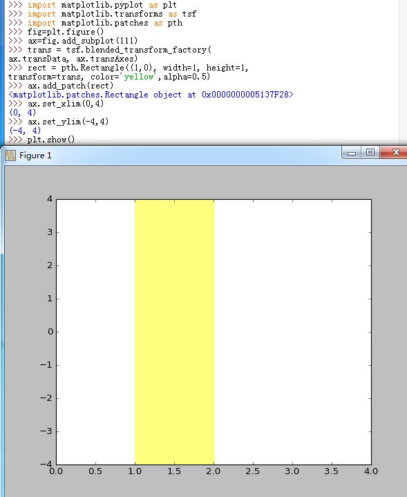

有两个函数返回特定的混合坐标系：

- `matplotlib.axes.Axes.get_xaxis_transform()`:等价于
  `matplotlib.transforms.blended_transform_factory(ax.transData, ax.transAxes)`。
  `x`坐标为`data`坐标系，`y`坐标为`Axes`坐标系。常用于绘制`x`轴的`label`、`tick`、`gridline`。
- `matplotlib.axes.Axes.get_yaxis_transform().`:等价于
  `matplotlib.transforms.blended_transform_factory(ax.transAxes,ax.transData)`。
  `x`坐标为`Axes`坐标系，`y`坐标为`data`坐标系。常用于绘制`y`轴的`label`、`tick`、`gridline`。


### 4. 利用坐标变换制造阴影效果

`matplotlib.transform.ScaledTranslation(xt, yt, scale_trans)`创建一个新的坐标转换对象，该坐标转换由`xt`和`yt`经过`scale_trans`坐标转换而来。
> 它创建的是一个偏移对于的坐标变换。偏移的坐标是位于`scale_trans`中的。

- 制作阴影的时候，将阴影的`zorder`调小，从而使得阴影首先绘制并位于底层
- 当`scale_trans`为`fig.dpi_scale_trans`坐标转换对象时，`xt`,`yt`的单位是像素。还有一个方法也能达到同样的效果：`matplotlib.transforms.offset_copy(trans,x=xt,y=yt,units='inches')`，但是该方法返回的坐标转换对象是`trans`合成了偏移之后的效果。

  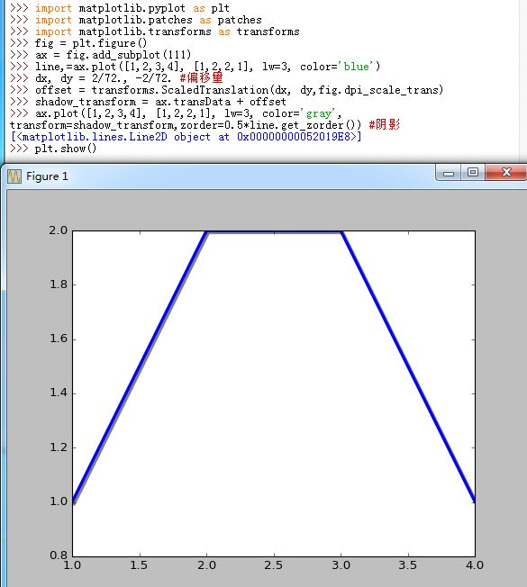

### 5. 直角坐标系、对数坐标系、极坐标系

#### a. 设置对数坐标系

通过`Axes.set_xscale(value,**kwargs)`/`Axes.set_yscale(value,**kwargs)`方法可以设置`x`轴/`y`轴是否对数坐标。其中`value`可以为:

- `linear`：线性
- `log`：对数。其中`basex`|`basey`关键字指定对数的基	
- `logit`：以2为底的对数
- `symlog`：对数，其中`basex`|`basey`关键字指定对数的基

你也可以通过`matplotlib.pyplot.xscale()`和`matplotlib.pyplot.yscale()`来设置对数坐标。一定要先添加数据后设置对数坐标。

  

#### b. 设置极坐标

通过`Figure.add_axes((left,bottom,width,height), projection='polar')`或者`Figure.add_axes((left,bottom,width,height), polar=True)`方法可以创建一个极坐标的`Axes`。其中`polar`关键字是为了兼容旧代码，新代码推荐用`projection`关键字，因为`projection`关键字不仅可以设置极坐标，还可以设置自定义坐标（它将坐标统一为映射关系）。
>`Figure.add_subplot(...)`也是同样的设置

  


## 八、技巧

### 1. 共享坐标轴

当你通过`pyplot.subplot()`、`pyplot.axes()`函数或者`Figure.add_subplot()`、`Figure.add_axes()`方法创建一个`Axes`时，你可以通过`sharex`关键字参数传入另一个`Axes`表示共享X轴；或者通过`sharey`关键字参数传入另一个`Axes`表示共享Y轴。

共享轴线时，当你缩放某个`Axes`时，另一个`Axes`也跟着缩放。

  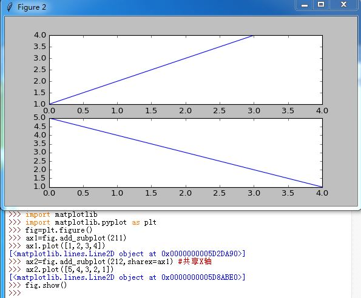

### 2. 创建多个 subplot 

如果你想创建网格中的许多`subplot`，旧式风格的代码非常繁琐：

```
#旧式风格
fig=plt.figure()
ax1=fig.add_subplot(221)
ax2=fig.add_subplot(222,sharex=ax1,sharey=ax1)
ax3=fig.add_subplot(223,sharex=ax1,sharey=ax1)
ax4=fig.add_subplot(224,sharex=ax1,sharey=ax1)
```

新式风格的代码直接利用`pyplot.subplots()`函数一次性创建：

```
#新式风格的代码
fig,((ax1,ax2),(ax3,ax4))=plt.subplots(2,2,sharex=True,sharey=True)
ax1.plot(...)
ax2.plot(...)
...
```

它创建了`Figure`和对应所有网格`SubPlot`。你也可以不去解包而直接：

```
#新式风格的代码
fig,axs=plt.subplots(2,2,sharex=True,sharey=True)
ax1=axs[0,0]
ax2=axs[0,1]
ax3=axs[1,0]
ax4=axs[1,1]
...
...
```

返回的`axs`是一个`nrows*ncols`的`array`，支持`numpy`的索引。

### 3. 调整日期显示

当`x`轴为时间日期时，有可能间隔太密集导致显示都叠加在一起。此时可以用`matplotlib.figure.Figure.autofmt_xdate()`函数来自动调整X轴日期的显式。

你也可以调整X轴的显示格式。当X轴为时间时，其显示由`Axes.fmt_xdata`属性来提供。该属性是一个函数对象或者函数，接受一个日期参数，返回该日期的显示字符串。`matplotlib`已经提供了许多`date formatter`，你可以直接使用`ax.fmt_xdata=matplotlib.dates.DateFormatter('%Y-%m-%d')`

  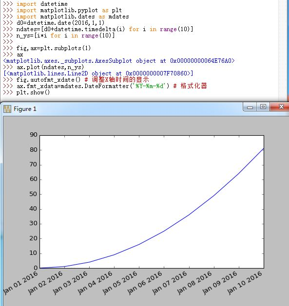

### 4.  fill_between() 

`Axes.fill_between(x,y1,y2=0,where=None,interpolate=False,step=None,**kwargs)`方法在`y1`和`y2`之间进行填充。

- `x`：一个长度为N的`array`，X轴数据
- `y1`:一个长度为N的`array`，Y轴数据1
- `y2`:一个长度为N的`array`，Y轴数据2，填充就是在曲线`[x,y1]`和`[x,y2]`包围的区域内进行
- `where`：可选的。
	- 如果为`None`，则表示任何地方都填充。
	- 如果不是`None`，那么就是一个长度为N的`boolean array`，填充只会在`where`为`True`的地方进行
- `interpolate`：一个`bool`值。如果为`True`，则计算曲线`[x,y1]`和`[x,y2]`相交点并插入交点；如果为`False`或`None`则不计算两条曲线的交点。
- `setp`：可选

通常建议提供一个`alpha`参数，用于设定填充的透明度。如果同一个区域被多个`fill_between()`填充，那么设定`alpha`之后会让每一层都能显示出来。	

例如：

```
import matplotlib.pyplot as plt
import numpy as np
np.random.seed(1234)
Nsteps = 500
t = np.arange(Nsteps)
mu = 0.002
sigma = 0.01
# the steps and position
S = mu + sigma*np.random.randn(Nsteps)
X = S.cumsum()
# the 1 sigma upper and lower analytic population bounds
lower_bound = mu*t - sigma*np.sqrt(t)
upper_bound = mu*t + sigma*np.sqrt(t)
fig, ax = plt.subplots(1)
ax.plot(t, X, lw=2, label='walker position', color='blue')
ax.plot(t, mu*t, lw=1, label='population mean', color='black', ls='--')
ax.fill_between(t, lower_bound, upper_bound, facecolor='yellow', alpha=0.5,
label='1 sigma range')
ax.legend(loc='upper left')
# here we use the where argument to only fill the region where the
# walker is above the population 1 sigma boundary
ax.fill_between(t, upper_bound, X, where=X>upper_bound, facecolor='blue', alpha=0.5)
ax.set_xlabel('num steps')
ax.set_ylabel('position')
ax.grid()  #开启网格
```

  

### 5. 设置透明 legend 

通常如果你能确定，比如右上角，没有数据，那么你能够非常安全的将`legend`放置在右上角从而不会遮盖你的图表，如`ax.legend(loc='upper right')`。如果你不知道你的数据曲线的样子，那么你可以使用`ax.legend(loc='best')`让`matplotlib`自动选择将`legend`放置在何处。

更有效的方法是设置`legend`为透明。方法为：`ax.legend(loc='best',fancybox=True,framealpha=0.5)`。
其中`fancybox`设置`legend`边框为圆角矩形，`framealpha`设置`legend`的透明度。

  

### 6. 放置 text box 

当你在`Axes`中放置`text box`时，你最好将它放置在`axes coordinates`下，这样当你调整X轴或者Y轴时，它能够自动调整位置。

你也可以使用`Text`的`.bbox`属性来让这个`Text`始终放在某个`Patch`中。其中`.bbox`是个字典，它存放的是该`Patch`实例的属性。

   

### 7. LATEX文字

要想在文本中使用`LATEX`，你需要使用`'$...$'`这种字符串（即使用`'$'`作为界定符）。通常建议使用`raw`字符串，即`r'$...$'`的格式，因为原生字符串不会转义`'\'`，从而使得大量的`LATEX`词法能够正确解析。

### 8. 平移坐标轴：

`Axes.spines`是个字典，它存放了四个键，分别为： `Axes.spines['left],Axes.spines['right],Axes.spines['top],Axes.spines['bottom]`
他们都是一个`matplotlib.spines.Spine`对象，该对象继承自`matplotlib.patches.Patch`对象，主要是设置图形边界的边框。

- `Spine.set_color('none')`：不显示这条边线
- `Spine.set_position((position)))`：将边线移动到指定坐标，其中`position`是一个二元元组，指定了 `(position type,amount)`，`position type`可以是：
	- `outward`：在绘图区域之外放置边线，离开绘图区域的距离由 `amount`指定（负值则在会去区域内绘制）
	- `axes`：在 `Axes coordinate`内放置边线（从 0.0 到 1.0 ）
	- `data`：在 `data coordinate` 内放置边线
	
	你也可以指定`position`为 ： `'center'`，等价于  `('axes',0.5)`；或者 `'zero'`，等价于 `('data',0.0)`


### 9. 设置轴线 tick 

`Axes.xaxis`返回一个`matplotlib.axis.XAxis`对象，`Axes.yaxis`返回一个`matplotlib.axis.YAxis`对象，他们都是 `matplotlib.axis.Axis`的子类对象，代表轴线。

- `Axis.set_ticks_position`：设置 `tick` 位置，可以为：` 'top' | 'bottom' | 'both' | 'default' | 'none'`，如果为 `'None'`则不显示 `tick`
- `Axis.set_label_position`：设置`label`位置，可以为：` 'top'| 'bottom'`


### 10、matplotlib.colors

`matplotlib.colors`是一个模块，用于转换数字或者颜色参数到 `RGB` 或者`RGBA`

- `RGB`：一个浮点数序列，有3个浮点数。每个数都是 0-1之间
- `RGBA`：一个浮点数序列，有4个浮点数。每个数都是 0-1之间

它里面有个常用的功能就是生成一个 `colormap`，它用于将一个数字序列转换成一个颜色序列。通常有下列两个步骤：

- 将数字归一化到0-1之间（通过` Normalize` 类对象或者其子类对象）
- 将0-1之间的数字映射到一个颜色 （通过 `Colormap` 类对象或者其子类对象）

`matplotlib.colors.ColorConverter` 提供了一个单例对象用于转换数字或者数字序列到 `color`。

####a. ListedColormap
`matplotlib.colors.ListedColormap(colors, name=’from_list’, N=None)`基类是`matplotlib.colors.Colormap`。它用于从一个`list of colors`中创建`colormap`

### 11. 绘制color map

- `matplotlib.pyplot.pcolor(*args, **kwargs)`：用于绘制颜色图，返回一个`matplotlib.collections.Collection `对象。常用的调用方法为：

	```
	pcolor(C)
	pcolor(C,**kwargs)
	```

- `matplotlib.pyplot.pcolormesh(*args, **kwargs)`：用于绘制一个四边形网格。它类似于 `pcolor()`，但是机制不同，且返回的是`QuadMesh`对象。它绘图更快。常用的调用方法为：

	```
	pcolormesh(C)
	pcolormesh(X,Y,C)
	pcolormesh(C,**kwargs)
	```

其中参数为：

- `C`：为一个 `masked array`。它会被转换成一个 `ColorMap`，然后对相应的网格图上颜色
- `X`和`Y`是网格参数，通常他们是从 `numpy.meshgrid(x_array,y_array))`获取。其中 `x_array`是一维数组，代表划分X轴网格的横坐标； `y_array`是一维数组，代表划分Y轴网格的纵坐标
	> X,Y,C 形状相同。其中X和Y对应于网格的划分，C对应于颜色的分配（相同C[i][j]值的网格，颜色相同）

  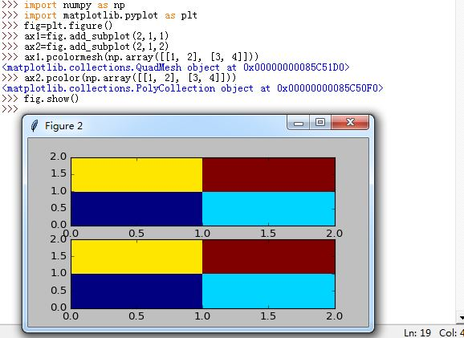
  
  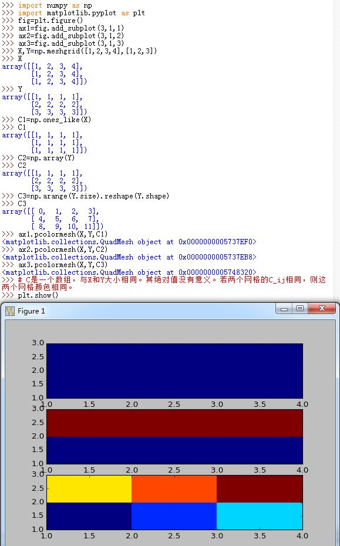

### 12. 清除绘图

你可以通过 `pyplot`来清除绘图：

- `pyplot.cla()`：清除`current axis`。非当前`axis`不受影响
- `pyplot.clf()`：清除`current figure`。但是它不关闭`window`
- `pyplot.close()`：关闭`window`

你也可以通过面向对象的方法：

- `Figure.clf()`：清除该`Figure`对象的所有内容。

### 13. 清除X坐标和Y坐标：

```
Axes.set_xticks(())
Axes.set_yticks(())
```