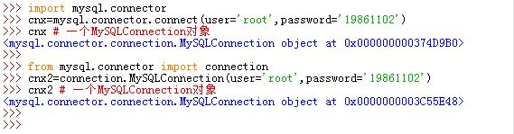
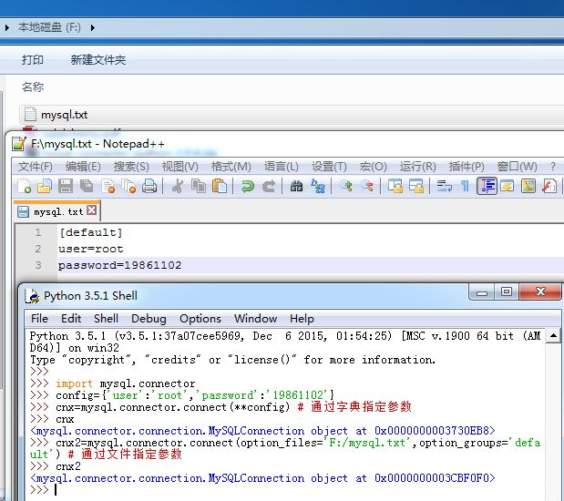
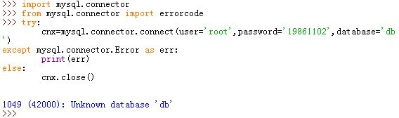
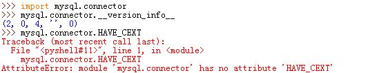
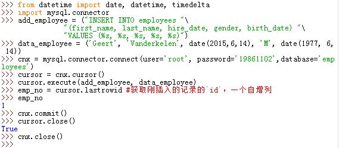
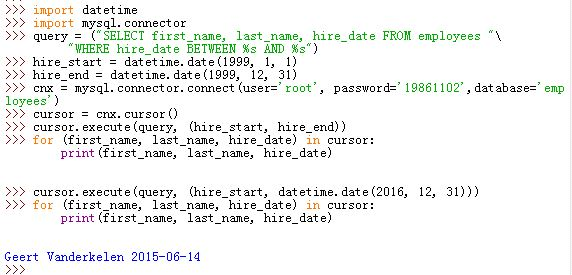
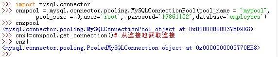

# mysql-connector-python 使用笔记 （基于2.0.4）

mysql-connector-python 是 Oracle 官方推出的`mysql`的`python connector`，下载地址可以从
 [MYSQL_PyPI](https://pypi.python.org/pypi/mysql-connector-python/2.0.4) 获取，参考文档可以从 [mysql document](http://dev.mysql.com/doc/connector-python/en/) 获取。

## 一、 安装

从`Oracle`官方下载了`zip`包之后，解压缩文件包。在命令后模式下进入该目录并执行命令`python setup.py install`即可安装。

## 二、 连接数据库

连接数据库有两种语法：函数式和类式，这两种用法是等价的。

- 函数式：

	```
	import mysql.connector
	cnx = mysql.connector.connect(user='scott', password='tiger',
           host='127.0.0.1',database='employees')
	cnx.close()
	```
- 类式：

	```
	from mysql.connector import connection
	cnx = connection.MySQLConnection(user='scott', password='tiger',
                host='127.0.0.1',database='employees')
	cnx.close()
	```

   

这两种方法的关键字参数如下：

- `user`或者`username`:用户名
- `password`或者`passwd`:密码
- `database`或者`db`:数据库名
>该关键字参数给出`current database`. 你也可以使用`USE SQL statement`或者设置`MySQLConnection`实例的`database property`来修改`current database`

- `host`:默认值`'127.0.0.1'`，`MySQL`服务器主机名或者`IP`地址
- `port`:默认值`3306`，`MySQL`服务器端口号，一个整数值
- `unix_socket`:`Unix socket file`路径
- `auth_plugin`:Authentication plugin to use. Added in 1.2.1.
- `use_unicode`:默认为`True`，Whether to use Unicode.
- `charset`:默认为`'utf8'`，Which MySQL character set to use.
- `collation`:默认为`'utf8_general_ci'`,Which MySQL collation to use.
- `autocommit`:默认为`False`,Whether to autocommit transactions.
- `time_zone`:Set the time_zone session variable at connection time.
- `sql_mode`:Set the sql_mode session variable at connection time.
- `get_warnings`:默认为`False`,Whether to fetch warnings.
- `raise_on_warnings`:默认为`False`,Whether to raise an exception on warnings.
- `connection_timeout (connect_timeout*)`:Timeout for the TCP and Unix socket connections.
- `client_flags`:MySQL client flags.
- `buffered`:默认为`False`,Whether cursor objects fetch the results immediately after executing queries.
- `raw`:默认为`False`,Whether MySQL results are returned as is, rather than converted to Python types.
- `consume_results`:默认为`False`,Whether to automatically read result sets.
- `ssl_ca`:File containing the SSL certificate authority.
- `ssl_cert`:File containing the SSL certificate file.
- `ssl_key`:File containing the SSL key.
- `ssl_verify_cert`:默认为`False`,When set to True, checks the server certificate against the certificate file specified by the ssl_ca option. Any mismatch causes a ValueError exception.
- `force_ipv6`:默认为`False`,When set to True, uses IPv6 when an address resolves to both IPv4 and IPv6. By default, IPv4 is used in such cases.
- `dsn`:Not supported (raises NotSupportedError when used).
- `pool_name`:连接池的名字. Added in 1.1.1.
- `pool_size`:默认为`5`,连接池的大小. Added in 1.1.1.
- `pool_reset_session`:默认为`True`,Whether to reset session variables when connection is returned to pool. Added in 1.1.5.
- `compress`:默认为`False`,Whether to use compressed client/server protocol. Added in 1.1.2.
- `converter_class`:Converter class to use. Added in 1.1.2.
- `fabric`:MySQL Fabric connection arguments. Added in 1.2.0.
- `failover`:Server failover sequence. Added in 1.2.1.
- `option_files `:指定的连接配置文件. Added in 2.0.0.
- `option_groups`:默认为`['client', 'connector_python']`，从配置文件中读取的配置组. Added in 2.0.0.
- `allow_local_infile`:默认为`True`,Whether to enable LOAD DATA LOCAL INFILE. Added in 2.0.0.
- `use_pure`:默认为`True`,如果为`True`表示使用纯`Python`接口；否则使用纯`C`接口. Added in 2.1.1.

参数的详细解释参考 [mysql connector connect params](http://dev.mysql.com/doc/connector-python/en/connector-python-connectargs.html)

### 1. 使用字典传递参数

如果你的参数较多，可以直接使用一个字典，然后使用`**`语法：

```
config = {
  'user': 'scott',
  'password': 'tiger',
  'host': '127.0.0.1',
  'database': 'employees',
  'raise_on_warnings': True,
}
cnx = mysql.connector.connect(**config)
}
```

### 2. 使用参数文件

在2.0版本之后，`mysql-connector-python`可以从参数文件中读取参数。你可以在`connect(...)`函数中使用以下的两个参数来使用该功能：

- `option_files`关键字参数：指定参数文件的文件名。这个关键字参数的值可以是文件路径名字符串，也可以是文件路径名的字符串的列表（此时将按照顺序读取文件）。默认情况下没有参数文件。
- `option_groups`关键字参数: 指定读取参数文件中的那个参数组（前提是读取参数文件来提取参数）。这个关键字参数的值可以是参数组名字的字符串，也可以是参数组名字的字符串的列表（此时按照顺序读取参数组）。默认值是`['client', 'connector_python']`，意思是读取
- Which groups to read from option files, if option files are `[client]` 和` [connector_python]`这两个参数组。

> 你可以在参数文件中使用 `!include`和`!includedir`指令，就像`MySQL`程序自己的参数文件中一样的用法。

如果你在`connect(...)`函数中，同时使用了`option_files`关键字参数以及其他配置值（如`database`关键字参数），则`option_files`关键字参数优先级较低。

如果参数文件读取失败，则抛出`ValueError`异常；如果参数文件已经读取过了，则重复读取参数文件会抛出`ValueError`异常。

对于参数文件中的内容：

- 如果是`option_groups`关键字参数（或者默认的）参数组，则该参数组内的所有选项必须是`mysql-connector-python`支持的选项，否则抛出`ValueError`异常
- 如果不是`option_groups`关键字参数（或者默认的）参数组，则`mysql-connector-python`不支持的选项会被忽略

  

### 3. 异常处理

在连接数据库时很可能会遇到各种异常，此时可以用异常处理，如下：

```
import mysql.connector
from mysql.connector import errorcode
try:
  cnx = mysql.connector.connect(user='scott',
                                database='testt')
except mysql.connector.Error as err:
  if err.errno == errorcode.ER_ACCESS_DENIED_ERROR:
    print("Something is wrong with your user name or password")
  elif err.errno == errorcode.ER_BAD_DB_ERROR:
    print("Database does not exist")
  else:
    print(err)
else:
  cnx.close()
```

  

### 4. 使用 C Extension

如果使用`use_pure=True`关键字参数，则连接数据库时使用的是纯Python接口。你可以通过`use_pure=False`指定使用`C Extension`接口。默认使用纯Python接口。

`mysql-connector-python 2.1.1`版本之后支持`C Extension`。这种接使用`MySQL C client library`。对于返回大量数据的查询操作，使用`C Extension`的效率较高。
> 为了验证是否支持`C Extension`，你可以用`mysql.connector.__version_info__ > (2, 1) and mysql.connector.HAVE_CEXT`来判断。其中：`mysql.connector.HAVE_CEXT`用于验证是否支持`C Extension`。


  

### 5. _mysql_connector C Extension

你可以直接导入`_mysql_connector`模块来使用`C Extension`，用法如下：

```
import _mysql_connector
ccnx = _mysql_connector.MySQL()
ccnx.connect(user='scott', password='tiger',
             host='127.0.0.1', database='employees')
ccnx.query("SHOW VARIABLES LIKE 'version%'")
row = ccnx.fetch_row()
while row:
  print(row)
  row = ccnx.fetch_row()
ccnx.free_result()
ccnx.close()
```

此时根本不需要导入`import mysql.connector`模块


## 三、 操作数据库

### 1. 创建表

所有的`DDL (Data Definition Language) statements`是通过一个叫做`cursor`的结构来执行的。

我们可以通过下列步骤来创建表：

- 定义一个表的创建字符串(`CREATE statements`)，如：

```
table_str="CREATE TABLE `employees` ("
    "  `emp_no` int(11) NOT NULL AUTO_INCREMENT,"
    "  `birth_date` date NOT NULL,"
    "  `first_name` varchar(14) NOT NULL,"
    "  `last_name` varchar(16) NOT NULL,"
    "  `gender` enum('M','F') NOT NULL,"
    "  `hire_date` date NOT NULL,"
    "  PRIMARY KEY (`emp_no`)"
    ") ENGINE=InnoDB"
```

- 创建数据库(而不是在连接中指定数据库)

```
import mysql.connector
from mysql.connector import errorcode
DB_NAME = 'employees'
cnx = mysql.connector.connect(user='scott')
cursor = cnx.cursor()
def create_database(cursor):
    try:
        cursor.execute(
            "CREATE DATABASE {} DEFAULT CHARACTER SET 'utf8'".format(DB_NAME))
    except mysql.connector.Error as err:
        print("Failed creating database: {}".format(err))
        exit(1)
try:
    cnx.database = DB_NAME    
except mysql.connector.Error as err:
    if err.errno == errorcode.ER_BAD_DB_ERROR: #数据库不存在
        create_database(cursor)
        cnx.database = DB_NAME
    else:
        print(err)
        exit(1)
```

- 创建表

```
try:
        print("Creating table {}: ".format(table_str), end='')
        cursor.execute(table_str)
except mysql.connector.Error as err:
        if err.errno == errorcode.ER_TABLE_EXISTS_ERROR:#表已存在
            print("already exists.")
        else:
            print(err.msg)
else:
        print("OK")
```

- 关闭`cursor`和`connection`

```
cursor.close()
cnx.close()
```

  

### 2. 插入表

插入和更新数据库也是通过`cursor`结构来完成的。如果你使用的是事务性存储引擎（比如`InnoDB`），那么当你在插入、更新、删除操作序列之后必须`commit`才能将你的更改作用于数据库。
 
插入表的步骤为：

- 创建插入语句

```
add_employee = ("INSERT INTO employees "
               "(first_name, last_name, hire_date, gender, birth_date) "
               "VALUES (%s, %s, %s, %s, %s)")
```
- 创建要插入的值

```
data_employee = ('Geert', 'Vanderkelen', tomorrow, 'M', date(1977, 6, 14))
```

- 插入记录

```
from datetime import date, datetime, timedelta
import mysql.connector
cnx = mysql.connector.connect(user='scott', database='employees')
cursor = cnx.cursor()
cursor.execute(add_employee, data_employee)
emp_no = cursor.lastrowid #获取刚插入的记录的`id`，一个自增列
```

- `commit`之后，关闭`cursor`和`connection`

```
cnx.commit()
cursor.close()
cnx.close()
```

>由于默认情况下`mysql-connector-python`关闭了`autocommit`，而`MySQL 5.5`以后的版本默认使用`InnoDB`引擎，因此必须在修改数据库之后使用`connection`的`commit`方法。当然如果你希望撤销更改也可以使用`connection`的`rollback`方法。

  

### 3.查询表

查询数据库也是通过`cursor`结构来完成的。
 
查询的步骤为：

- 创建查询语句

```
query = ("SELECT first_name, last_name, hire_date FROM employees "
         "WHERE hire_date BETWEEN %s AND %s")
```

- 创建查询值

```
hire_start = datetime.date(1999, 1, 1)
hire_end = datetime.date(1999, 12, 31)
```

- 查询

```
import datetime
import mysql.connector
cnx = mysql.connector.connect(user='scott', database='employees')
cursor = cnx.cursor()
cursor.execute(query, (hire_start, hire_end))
for (first_name, last_name, hire_date) in cursor:
  print("{}, {} was hired on {:%d %b %Y}".format(
    last_name, first_name, hire_date))
```

- 关闭`cursor`和`connection`

```
cursor.close()
cnx.close()
```

`mysql-connector-python`会自动将`Python`的数据类型转换成`MySQL`理解的类型（如日期类型）。

  

## 四、连接池

 `mysql-connector-python 1.1.1`之后支持连接池技术，它由`mysql.connector.pooling`模块实现。
    
### 1.连接池的性质

一个连接池打开了一组连接并且能够给使用者提供线程安全的连接。

- 连接池的大小（即连接数量）在连接池创建的时刻指定，然后固定不变。
- 连接池的名字在创建时刻指定。如果未指定，则根据连接参数来自动命名。你可以通过连接池对象获取它的名字，也可以通过连接获取连接池的名字
- 你可以同时使用多个连接池，这些连接池可以连接不同的`MySQL`服务器。
- 如果连接池的连接耗尽，则抛出`PoolError`异常
- 你可以重新配置连接池的连接参数。此后该连接池的所有连接就会使用新的连接参数。

### 2.连接池的创建

连接池可以显式或者隐式的被创建。

#### a. 隐式创建

隐式创建连接池：打开一个连接，提供一个或者多个`pool-related`参数，如`pool_name,pool_size`：

```
dbconfig = {
  "database": "test",
  "user":     "joe"
}
cnx = mysql.connector.connect(pool_name = "mypool",
                              pool_size = 3,
                              **dbconfig)
```

其中`pool_name`必须是数字或字母或`., _, *, $,#`组成，长度不超过`pooling.CNX_POOL_MAXNAMESIZE`（默认为64）个字符。`pool size`必须是大于0的整数，
且小于`pooling.CNX_POOL_MAXSIZE` (默认为32)。只要这两个参数之一存在，则`mysql-connector-python`会创建一个新的连接池。

- 若`pool_name`未提供而只提供`pool_size`，则`connect()`根据其参数自动生成一个`pool_name`
- 若`pool_size`未提供只提供`pool_name`，则默认取`pool_size`为5

后面只要通过同一个`pool_name`调用`connect()`，则会从该连接池中返回连接，此时本次`connect()`调用的`pool_size`以及其他参数会被忽略。

在隐式创建连接池时，返回的连接是一个`pooling.PooledMySQLConnection`类对象，而不是一个`MySQLConnection`类对象（默认调用`connect()`而不使用`pool_name`和`pool_size`时）。`PooledMySQLConnection`类对象非常类似`MySQLConnection`类对象，但是有以下区别：

- `PooledMySQLConnection`类对象的`close()`方法并不真的关闭该连接，而是将该连接放回连接池从而服务下一次连接请求
- `PooledMySQLConnection`类对象不能够通过`config()`方法来修改连接的配置，而只能通过修改连接池的配置从而间接修改`PooledMySQLConnection`类对象的连接配置。
- `PooledMySQLConnection`类对象有一个`pool_name property`来返回连接池的名字

  

#### b. 显式创建

显式创建一个连接池就是创建一个`pooling.MySQLConnectionPool`连接池对象。

```
dbconfig = {
  "database": "test",
  "user":     "joe"
}
cnxpool = mysql.connector.pooling.MySQLConnectionPool(pool_name = "mypool",
                                                      pool_size = 3,
                                                      **dbconfig)
```

- 从连接池获取连接，可以用连接池的`get_connection()`方法。如:`cnx1 = cnxpool.get_connection()`
- 重新配置连接池的连接参数，你可以用`set_config()`方法。如

```
dbconfig = {
  "database": "performance_schema",
  "user":     "admin",
  "password": "secret"
}
cnxpool.set_config(**dbconfig)
```
一旦重新配置了连接池的连接参数，那么此后从该连接池中获取的连接就是使用的新的连接参数。而在此之前从该连接池中获取的连接保持不变（直到它们被重新放回连接池）。

  

## 五、Fabric Support

MySQL Fabric能“组织”多个MySQL数据库，是应用系统将大于几TB的表分散到多个数据库，即数据分片(Data Shard)。在同一个分片内又可以含有多个数据库，并且由Fabric自动挑选一个适合的作为主数据库，其他的数据库配置成从数据库，来做主从复制。在主数据库挂掉时，从各个从数据库中挑选一个提升为主数据库。之后，其他的从数据库转向新的主数据库复制新的数据。注意：这里说的“自动”是指由MySQL Fabric在后台完成，而不需要用户手动更改配置。最重要的是，MySQL Fabric是GPL的开源软件，也就是在符合GPL的规范下，你可以自由的使用和修改这个软件。

Connector/Python 1.2.0 and up supports Fabric and provides these capabilities:

- Requesting a connection to a MySQL server managed by Fabric is as transparent as possible to users already familiar with Connector/Python.
- Connector/Python is able to get a MySQL server connection given a high-availability group and a mode specifying whether the connection is read-only or also permits updates (read-write).
- Connector/Python supports sharding and is able to find the correct MySQL server for a given table or tables and key based on scope (local or global) and mode (read-only or read-write). RANGE and HASH mechanisms are supported transparently to the user.
- Among secondary MySQL servers in the same group, load balancing of read-only operations occurs based on server weight.
- Faulty MySQL servers are reported to Fabric, and failover is supported when failure occurs for a server in a group.
- Connector/Python caches information coming from Fabric to speed up operations. Failures connecting to a MySQL server reset this cache. The time to live for cached information can be set by Fabric, or a default is used otherwise.
- Fabric support applies to versions of Python supported by Connector/Python itself (see Chapter 3, Connector/Python Versions). In particular, you can use Connector/Python with Python 3.1 and later to establish Fabric connections, even though Fabric does not support Python 3.


## 六、Django Backend

Connector/Python 1.1.1 and up includes a mysql.connector.django module that provides a Django backend for MySQL. This backend supports new features found in MySQL 5.6 such as fractional seconds support for temporal data types.
Django Configuration

Django uses a configuration file named settings.py that contains a variable called DATABASES (see https://docs.djangoproject.com/en/1.5/ref/settings/#std:setting-DATABASES). To configure Django to use Connector/Python as the MySQL backend, the example found in the Django manual can be used as a basis:

```
DATABASES = {
    'default': {
        'NAME': 'user_data',
        'ENGINE': 'mysql.connector.django',
        'USER': 'mysql_user',
        'PASSWORD': 'priv4te',
        'OPTIONS': {
          'autocommit': True,
        },
    }
}
```

It is possible to add more connection arguments using OPTIONS.
Support for MySQL Features

Django can launch the MySQL client application mysql. When the Connector/Python backend does this, it arranges for the sql_mode system variable to be set to TRADITIONAL at startup.

Some MySQL features are enabled depending on the server version. For example, support for fractional seconds precision is enabled when connecting to a server from MySQL 5.6.4 or higher. Django's DateTimeField is stored in a MySQL column defined as DATETIME(6), and TimeField is stored as TIME(6). For more information about fractional seconds support, see Fractional Seconds in Time Values. 