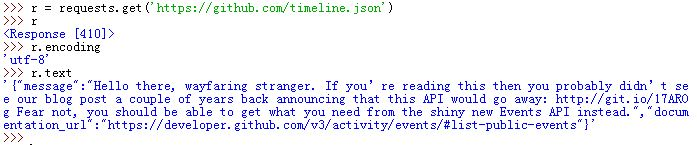
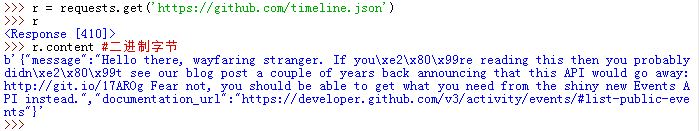
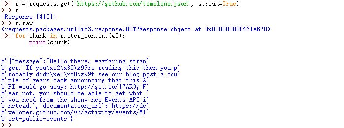
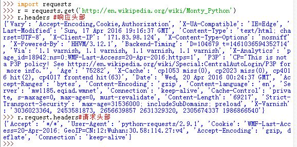
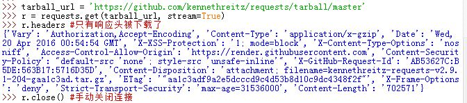
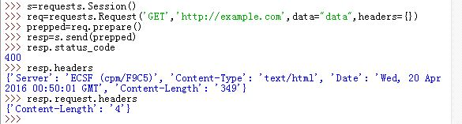
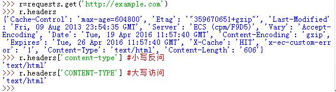
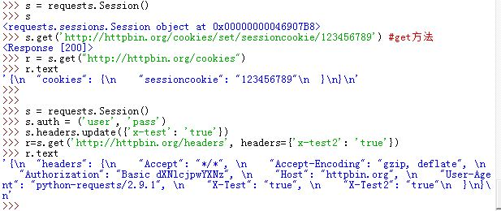

# Reuqests笔记（基于requests2.9.1）

## 一、发送请求

`requests`提供了几乎所有的HTTP请求功能：`GET`、`OPTIONS`、`HEAD`、`POST`、`PUT`、`PATCH`、`DELETE`。

- `r=requests.get('http://example.com/')`：发送`GET`请求
- `r=requests.post('http://example.com/')`：发送`POST`请求
- `r=requests.put('http://example.com/')`：发送`PUT`请求
- `r=requests.delete('http://example.com/')`：发送`DELETE`请求
- `r=requests.head('http://example.com/')`：发送`HEAD`请求
- `r=requests.options('http://example.com/')`：发送`OPTIONS`请求
- `r=requests.patch('http://example.com/')`：发送`PATCH`请求


这些函数的返回值都是一个`Response`对象，这个对象中存放着我们所想要的信息。

  

> `r=requests.options(url)`会返回服务器支持那些HTTP请求类型。这些请求类型在`r.headers['allow']`中查看。

## 二、为URL传递参数
`requests`允许你使用`params`关键字传递参数，该参数是一个字典，从而构建带查询字符串的URL。如：
`r=requests.get('http://example.com/',params={'key1':value1,'key2':value2})`。
通过打印输出`Response`对象的`url`属性，你可以看到URL正确解码。
> `params`字典里如果有值为`None`，则对应的键不会添加到URL的查询字符串里。

  

## 三、响应内容

### 1. 文本响应内容

`requests`会自动解码来自服务器的内容。大多数`unicode`字符集都能够被无缝地解码。请求发出之后，`requests`会基于`HTTP`头部对响应的编码做出有根据的推测。当你方位`r.text`时，`requests`会使用推测的文本编码。
>`requests`会首先在响应头部检测是否存在指定的编码方式；如果不存在则会去猜测编码方式。

你可以使用`r.encoding`来查看`requests`的编码；也可以通过赋值`r.encoding='UTF-8'`来显式的指定编码。如果你改变了编码，则每当你访问`r.text`时，`requests`会使用`r.encoding`的最新值。

  

### 2. 二进制响应内容

你也可以通过`r.content`用字节的方式访问响应内容。`requests`会自动为你解码`gzip`和`deflate`传输编码的响应数据。

  

### 3. JSON响应内容

`requests`内置了一个JSON解码器，`r.json()`通过它将数据解析成JSON格式。如果解析失败则抛出`ValueError`异常。

  

### 4. 原始响应内容

有时候你可能像获取来自于服务器的原始套接字响应，那么`r.raw`可以访问到该套接字响应。但是前提是你在初始请求中设置了`stream=True`。

为了处理原始数据，你需要使用`Response.iter_content()`方法。当使用流下载时，优先使用该方法。

  

## 三、请求与响应对象
任何时候通过`requests`发送请求，它都在做两件事情：

- 构建一个`Request`对象，该对象将被发送到某个服务器请求或者查询一些资源。
- 一旦`requests`得到一个从服务器返回的响应就会产生一个`Response`对象。该对象包含服务器返回的所有信息，也包含你原来创建的`Request`对象。如：`r.headers`包含了服务器返回的响应头部信息，`r.request.headers`包含了发送请求的请求头部信息。
>`r.request`包含了发送的请求。

  

## 四、响应体内容工作流

默认情况下，当你进行网络请求后，响应体会立即被下载。你可以通过`stream=True`参数覆盖这个行为，推迟下载响应体直到访问`Response.content`属性。此时仅有响应头被下载下来，连接保持打开状态。

- 可以根据响应头里的信息判断，从而决定是否应该访问`Response.content`属性从而下载响应体。
- 也可以进一步使用`Response.iter_content`和`Response.iter_lines`方法来控制工作流，或者以`Response.raw`从底层读取。

注意：当你对一个请求设置了`stream=True`参数之后，`Request`会保持连接一直到你读取了所有的响应内容（包括响应体）或者你手动调用`Response.close`之后才会关闭连接并释放连接。如果你只是读取了部分响应内容，则你需要手动调用`Response.close`来关闭连接。

  

### 1. 流式迭代
通常在设置`stream=True`之后，使用`requests.Response.iter_lines()`来进行流式迭代。如：

```
import json
import requests
r = requests.get('http://httpbin.org/stream/20', stream=True)
for line in r.iter_lines():
    # filter out keep-alive new lines
    if line:
        print(json.loads(line))
```

## 五、定制请求头

如果你想为请求添加HTTP头不，则通过`headers`关键字参数传入一个字典即可，如`r=requests.get('http://example.com/',headers={'key1':value1,'key2':value2})`。

## 六、定制请求头以及请求体
有的时候你希望在发送请求之前修改它的头部或者请求体内容。你可以通过下面的方法：

```
from requests import Request, Session
s = Session()
req = Request('GET', url,
    data=data,
    headers=header
)
prepped = req.prepare()
# do something with prepped.body
# do something with prepped.headers
resp = s.send(prepped,
    stream=stream,
    verify=verify,
    proxies=proxies,
    cert=cert,
    timeout=timeout
)
```

  

在创建`Request`对象之后，通过`Session`实例发送或者通过`requests.*`发送`PreparedRequest`实例。其中`PreparedRequest`实例是由`Request`实例的`.prepare()`方法返回。

但是上述方法对于`Session`有个缺陷：它无法使用`Session`的机制。`Session`会默认在每个请求直接共享`Cookie`，但是按照上面手动创建`PreparedRequest`的方法，共享的`Cookie`并不会被添加进本次请求对象中来。可以通过`Session`实例的`prepare_request()`方法来改进：

```
from requests import Request, Session
s = Session()
req = Request('GET', url,
    data=data,
    headers=header
)
prepped = s.prepare_request(req) #利用了Session的共享机制
...
```

## 七、更加复杂的POST请求

### 1. POST表单数据

如果你需要实现POST表单数据的效果，你可以通过`data`关键字参数传入一个字典即可。你的数据字典在发出请求的时候会自动编码为表单形式。如`r=requests.post('http://example.com/',data={'key1':value1,'key2':value2})`。

  

如果你要POST的数据并非编码为表单形式的，如`string`而不是`dict`，那么数据会被直接发布出去。

  

### 2. POST 一个多部分编码的文件


#### a. 流式上传

通过POST请求中指定`files`关键字参数，你可以上传一个文件。如:
`r=requests.post('http://example.com/',files={'file':open('expl.xls','rb'}`，仅仅需要为你的请求体提供一个类文件对象即可。这称之为流式上传，它允许你发送大的数据流或者文件而无需先把他们读入内存中。这里要求以二进制打开文件。

你也可以显式的指定文件名和请求头。如：
`r=requests.post('http://example.com/',files={'file':('report.xls', open('report.xls', 'rb'), 'application/vnd.ms-excel', {'Expires': '0'})})`

你也可以将字符串作为当作文件来上传一个文件。此时在服务器端会生成一个文件，该文件的内容就是你发送的字符串。如：
`r=requests.post('http://example.com/',files={'file':('report.txt', 'data to send\n data to send\n')})`

  

#### b. 块编码请求
对于出去和进来的请求，`requests`也支持分块传输编码。要发送一个块编码请求，只需要为你的请求体提供一个生成器（或者一个没有具体长度的迭代器，有具体长度的则不行）。如

```
def gen():
    yield 'hi'
    yield 'there'
requests.post('http://some.url/chunked', data=gen())
```

#### c. POST一个多部分编码文件
为了在一个POST中上传多个文件，你可以将文件放入一个`tuple`列表中，`tuple`为`(form_filed_name,file_info)`。
如：

```
url = 'http://httpbin.org/post'
multiple_files = [('images', ('foo.png', open('foo.png', 'rb'), 'image/png')),
                      ('images', ('bar.png', open('bar.png', 'rb'), 'image/png'))]
r = requests.post(url, files=multiple_files)
```

## 八、响应状态码

- 通过`r.status_code`来返回响应的状态码
- `requests`附带了一个内置的状态码查询对象：`r.status_code==requests.codes.ok`。
- 如果发送了一个失败请求（非200请求），我们可以通过`r.raise_for_status()`来抛出异常。但是如果发送的请求成功（200请求），则`r.raise_for_status()`不做任何事情。

  

  

## 九、响应头

通过 `r.headers`查看一个Python字典形式展示的服务器响应头。但是这个字典比较特殊：它是仅仅为了HTTP头部而生成的，由于HTTP头部是大小写不敏感的，因此我们可以以任意大写形式来访问这些响应头字段。

 

## 十、Cookie

在响应中如果包含一些`Cookie`，你可以通过`r.cookies['key']`来访问它。如果你想发送`Cookie`数据到服务器，可以使用`cookies`关键字参数传入作为`Cookie`的字典。

  

## 十一、Session
`Sessio`n对象能够让你跨请求保持某些参数。同一个`Session`实例发出的所有请求直接也会保持`Cookie`。`Session`对象具有主要的`requests API`的所有方法。

- `Session`可用于跨请求保持一些`Cookie`。
- `Session`可用于为请求方法提供缺省数据，这是通过为`Session`对象的属性提供数据来实现
- 任何传递给请求方法的字典都会与已经设置的`Session`数据合并。方法层的参数会覆盖Session的参数。因此如果想删除`Session`中的某些数据，可以在方法层中，通过关键字参数将它设为`None`即可
	>这里的`Session`与服务器编程中的`session`不同。服务器编程的`session`值得是在服务器端保持的会话。而这里的`Session`是在用户端保持的。

  

## 十二、重定向
默认情况下，除了`HEAD`请求之外，`requests`会自动处理所有的请求的重定向。

- 可以使用`r.history`来追踪重定向。`r.history`是一个`requests.Response`对象的列表，表示为了完成请求而创建了这些对象。这个对象列表按照从最老到最近的请求进行了排序。
- 如果你使用的是`GET`、`OPTIONS`、`POST`、`PUT`、`PATCH`、或者`DELETE`请求，则可以通过`allow_redirects=False`参数禁用重定向处理。
- 如果你使用的是`HEAD`，你也可以通过`allow_redirects=True`来启用重定向处理。

  

## 十三、超时
你可以指定`requests`在经历过某个时长之后，如果服务器未能响应则抛出异常。方法为：在请求中添加`timeout`关键字参数，其值为浮点数表示的秒数。如`r=requests.get('http://example.com', timeout=0.001)`。

如果`timeout=None`，则表示永不超时（你会一直等待对方服务器响应）。

另外这个超时时间可以提供一个二元的元组如`(3,27)`。第一个数表示`connect`超时时间（即TCP连接建立的超时时间），第二个数是数据处理时间（即服务器响应数据的第一个字节到达本地的时间）。前述的超市时间是这两个时间的总和。而这里是分别设定超时时间。

> 超时针对的是连接过程，而不是响应体的下载。`timeout`并不是整个下载响应的时间限制，而是说如果服务器在`timeout`秒内没有应答，则引发超时。

## 十四、SSL证书验证
`requests`可以为`HTTPS`请求验证`SSL`证书，就像`web`浏览器一样。通过在请求中使用`verify`关键字参数，其值为`True`，从而开启`SSL`证书验证。如`requests.get('https://github.com', verify=True)`

- 如果你将`verify`设置为`False`，则`requests`忽略对`SSL`证书的验证。默认情况下`verify`为`True`。
- 你可以指定一个本地证书作为客户端证书。可以是单个文件（包含密钥和证书）或一个包含两个文件路径的元组。如
  `requests.get('https://kennethreitz.com', cert=('/path/server.crt', '/path/key'))`。
  如果指定了一个错误路径或者一个无效证书，则抛出`SSLError`异常。

## 十五、持久连接
归功于`urllib3`，同一个会话内的持久连接完全是自动处理的。同一会话内你发出的任何请求都会自动复用恰当的连接。

但是可能连接池已空。比如你将`stream=True`之后，并没有手动关闭该链接或者读取响应的内容，此时该连接并不释放回连接池。如果这种连接非常多，则会 快速消耗连接池。

## 十六、代理

你可以为请求方法提供`proxies`关键字参数来配置单个请求的代理。也可以通过环境变量设置`HTTP_PROXY`和`HTTPS_PROXY`来配置代理。
如：

```
import requests
proxies = {
  "http": "http://10.10.1.10:3128",
  "https": "http://10.10.1.10:1080",
}
requests.get("http://example.org", proxies=proxies)
```

## 十七、错误与异常

- 遇到网络问题（如DNS查询失败、拒绝连接等）：`requests`抛出一个`ConnectionError`异常
- 遇到无效的HTTP响应：`requests`抛出一个`HTTPError`异常
- 请求超时：`requests`抛出一个`Timeout`异常	
- 请求超过了设定的最大重定向次数：`requests`抛出一个`TooManyRedirects`异常

所有`requests`显式抛出的异常都继承自`requests.exceptions.RequestException`

## 十八、身份认证

### 1. 基本身份认证
许多身份认证的`web`服务都接受`HTTP Basic Auth`。这是一种最简单的身份认证。在`requests`中使用基本身份认证的方式为：

- `requests.get('http://example.com',auth=requests.auth.HTTPBasicAuth('user','password')`
- 简写方式为:`requests.get('http://example.com',auth=('user','password')`

### 2.摘要式身份认证
另一种流行的HTTP身份认证形式是摘要式身份认证，`requests`中使用摘要式身份认证的方式为：
 `requests.get('http://example.com',auth=requests.auth.HTTPDigestAuth('user','password')`

