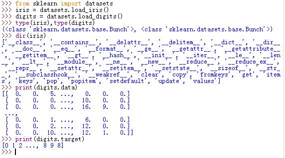
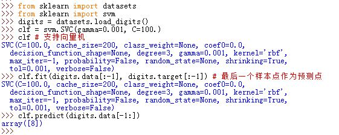
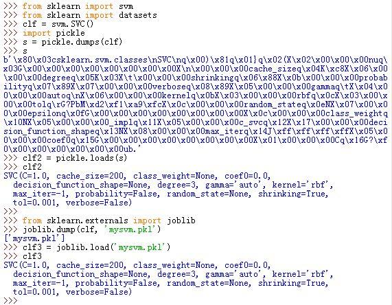

# Quick Start

1.机器学习的问题分类：

机器学习的目的是通过给定的一系列采样点来试图预测未知数据的特性。通常样本数据都是多维度的，每一个维度定义了一个特征（或者乘坐属性）。机器学习的问题可以大致如下分类：

- 监督学习：样本数据已经正确的标定。监督学习可以分为分类问题和回归问题
- 非监督学习：主要用于聚类、密度估计、降维

2.`scikit-learn` 自带了一些标准的数据集。如：

- `iris`和`digits`数据集：用于分类.
	- `iris`: 用于分类鸢尾花的50个样本点，这些样本点属于三种鸢尾花。它有四个特征：萼片和花瓣的长度和宽度。
	- `digits`：用于手写数字识别。
- `boston house prices dataset` 数据集：用于回归

我们可以通过下面的方法来加载数据集：

```
from sklearn import datasets
iris = datasets.load_iris()
digits = datasets.load_digits()
```

数据集对象是一个类似字典的对象，它持有底层的数据以及某些关于数据的`metadata`。

- `digits.data`：存储了数据。它是一个 二维的`(n_samples,n_features)`大小的数组。 `n_samples`为样本点数量，`n_features`为特征数量。
- 在监督学习中， `digits.target` 存放着标定结果
- 所有的数据都是二维数组，其中第一维为样本点数量 `n_samples`， 第二维是特征`n_features`。但是有可能特征本身是多维的

  

3.**学习和预测**：在 `scikit-learn`中，一个`estimator` 是一个实现了 `.fit(X,y)`方法和 `.predict(T)`方法的 Python对象。

- `.fit(X,y)`方法实现训练过程。其中`X`为训练集样本点的特征，`y`为对应的标定
- `.predict(T)`方法实现预测过程。其中`T`为某个待预测点的特征

如用支持向量机预测手写数字识别：

```
from sklearn import datasets
from sklearn import svm
digits = datasets.load_digits()
clf = svm.SVC(gamma=0.001, C=100.)
clf.fit(digits.data[:-1], digits.target[:-1]) # 最后一个样本点作为预测点
clf.predict(digits.data[-1:])
```

  

4.**模型存储**：当你学习到一个模型的时候，你可能需要将它存储一起来从而在将来随时用于预测数据。有两种方法可以存储：

- 利用Python的 `pickle`模块：

	```
	import pickle
	...
	s=pickle.dumps(clf) # 存储模型	
	clf2=pickle.loads(s)# 加载模型
	clf2.predict(...)
	...
	```
- 利用`sklearn.externals.joblib`
	
	```
	from sklearn.externals import joblib
	joblib.dump(clf,'filename.pkl')
	...
	clf2=joblib.load('filename.pkl')
	```
	> `joblib.dump(...)`返回一个文件名的列表。因为每个`clf`对象包含的`numpy`数组可能较大，此时它可能会分散到多个文件中。

  

5.惯例： `scikit-learn estimator`遵守以下惯例：

- 除非显式指定数据类型，否则所有的输入数据都被转换成 `float64`
- 回归问题的输出被转换成 `float64`；分类问题的输出不被转换
- `estimator`的参数可以更新：
	- `estimator.set_params(...)`方法可以显式更新一个`estimator`的参数值
	- 多次调用`estimator.fit(...)`方法可以隐式更新一个`estimator`的参数值。最近的一次训练学到的参数会覆盖之前那次训练学到的参数值。
