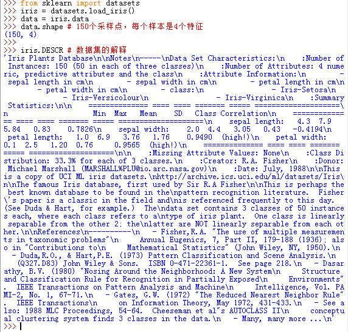
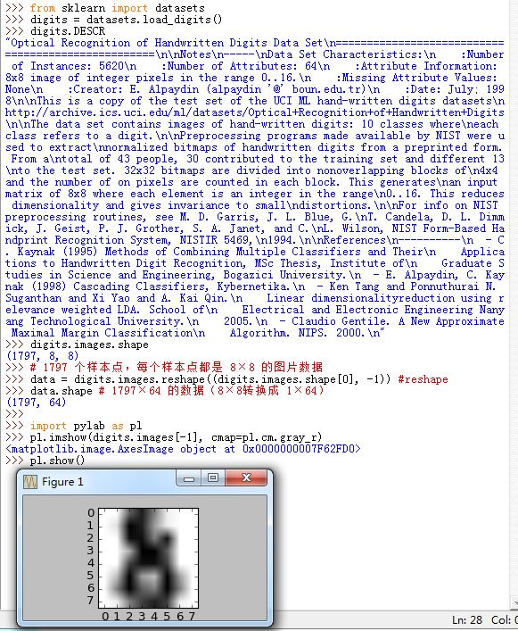
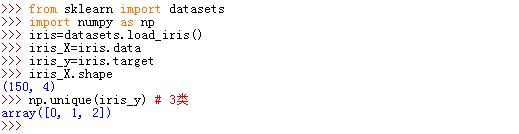
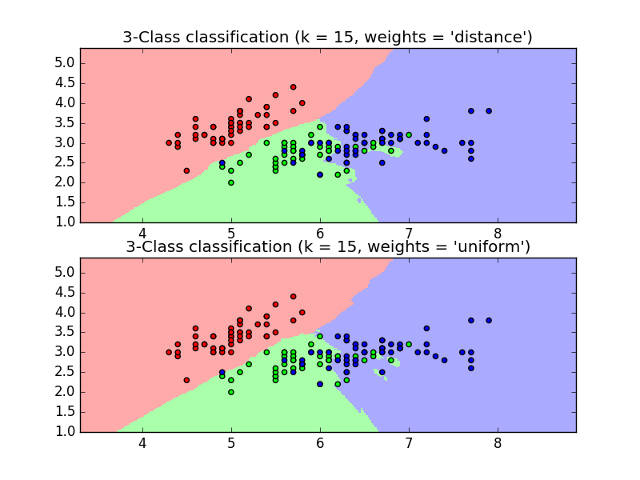
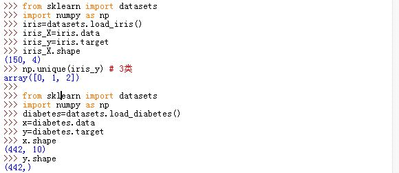
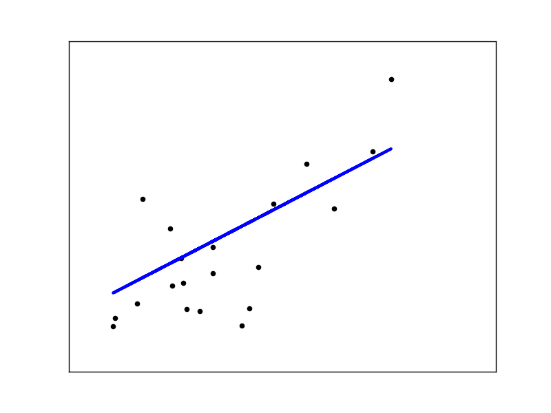
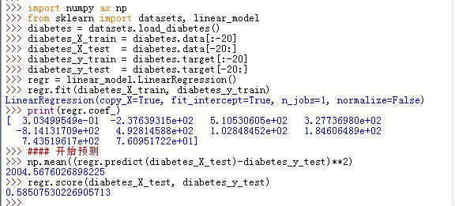
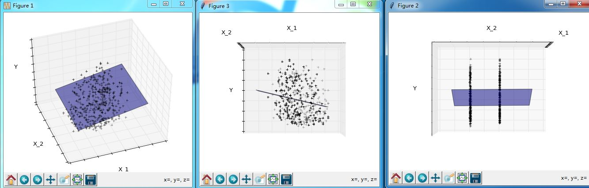

# 数据处理

这部分主要是关于数据的统计学习（另一部分是文本处理）。

## 一、数据集和评估器

1.`scikit-learn`处理的数据集是二维数组。其物理解释是：一个多维对象的列表，其中第一维是`sample axis`，第二维是`freature axis`

  

如果数据集不是 `(n_samples,n_features)`形状，则你需要预处理数据（`reshape`）从而能够应用于`scikit-learn`中。

  

2.`estimator`对象：`scikit-learn`提供的最重要的 API 都是由 `estimator`提供的。

- `estimator`提供一个`.fit(...)`方法，其参数通常是一个数据集（二维数组），用于模型学习
- `estimator`的参数可以在初始化的时候设置。当然你也可以在初始化`estimator`之后来通过对应的属性来设置。
- `estimator`从数据集训练结束之后，所有待评估的参数都被评估完毕。你可以通过`estimator.estimatedparam_`这种属性名加上下划线结尾的办法来获取。
- `estimator`提供了一个 `.score(...)`方法，其参数通常是一个预测集，用于评估`estimator`的性能
- `estimator`提供了一个`.predict(...)`方法，其参数通常是一个未标记的样本，用于预测它的输出

## 二、监督学习

### 1>  最近邻算法和维度诅咒

1.`iris dataset`是一个典型的分类问题。`iris` 类别有三类`Setosa, Versicolour, and Virginica`。每个样本都有四个特征：萼片和花瓣的长度和宽度。

  

2.`knn classifier`：k 近邻分类器。最简单的 k 近邻分类器是最近邻分类器。给定一个实例 \\(\mathbf x\\)，找出它在训练集中最近的样本点，该样本点所属的类就是 \\(\mathbf x\\) 的分类。

```
import numpy as np
import matplotlib.pyplot as plt
from matplotlib.colors import ListedColormap
from sklearn import neighbors, datasets

n_neighbors = 15 # k值

# 导入数据集
iris = datasets.load_iris()
X = iris.data[:, :2]  # 仅仅使用前两个特征，这样的目的是为了绘制图形方便（二维图形）
y = iris.target

h = .02  # step size in the mesh

# 分类和绘图
cmap_light = ListedColormap(['#FFAAAA', '#AAFFAA', '#AAAAFF']) #用于绘制网格图
cmap_bold = ListedColormap(['#FF0000', '#00FF00', '#0000FF']) # 用于绘制散点图

figure=plt.figure()
ax1=figure.add_subplot(2,1,1)
ax2=figure.add_subplot(2,1,2)
ax=[ax1,ax2]
for weights in ['uniform', 'distance']: #两种不同的权重
    ########## 创建 Neighbours Classifier 然后训练数据########
    clf = neighbors.KNeighborsClassifier(n_neighbors, weights=weights)
    clf.fit(X, y)
    ##### 将图形划分成若干个网格，判断每个网格所属的分类##########
     x_min, x_max = X[:, 0].min() - 1, X[:, 0].max() + 1 ## x轴边界
    y_min, y_max = X[:, 1].min() - 1, X[:, 1].max() + 1 ## y轴边界
    xx, yy = np.meshgrid(np.arange(x_min, x_max, h),
                         np.arange(y_min, y_max, h)) ## 划分
    Z = clf.predict(np.c_[xx.ravel(), yy.ravel()]) ## 对每个网格交点，判断它的类型
    Z = Z.reshape(xx.shape) #变形为 xx的形状
    ax[weights=='uniform'].pcolormesh(xx, yy, Z, cmap=cmap_light) ##绘制一个color plot

    ###### 绘制训练样本的分类 #####
    ax[weights=='uniform'].scatter(X[:, 0], X[:, 1], c=y, cmap=cmap_bold)
    ax[weights=='uniform'].set_xlim(xx.min(), xx.max())
    ax[weights=='uniform'].set_ylim(yy.min(), yy.max())
    ax[weights=='uniform'].set_title("3-Class classification (k = %i, weights = '%s')"
              % (n_neighbors, weights))
    figure.savefig("F:/knn.png")
```
其中权重的解释为：

- `'uniform'`：本节点的所有邻居节点的投票权重都相等
- `'distance'`：本节点的所有邻居节点的投票权重与距离成反比。即越近的节点，其投票权重越大

  

3.为了使得`estimator`更有效，你需要使得最近邻点到当前点的距离小于某个值`d`，否则距离太大则降低了算法预测的准确性。假设`d=0.01`，那么你需要100个平均分布的点才能够把一个单位区间以每个点距离不超过 0.01 采样。而当维度增加到 10 维时，为了能将这个10维的单位超立方体均匀采样，每个点距离不超过 0.01，那么你需要 10^10 个点。比单位区间大了 10^8倍。这就叫做`curse of dimensionality`

### 2> 线性模型

1.`diabetes dataset`：由10个生理指标（如身高，性别，体重，血压等）组成的多维样本点，442个样本点（来源于病人）。任务是根据这些生理指标来预测疾病的发展程度

  

#### a.线性回归模型

1.线性回归模型： \\(y=\mathbf x \beta+\epsilon\\)

```
import matplotlib.pyplot as plt
import numpy as np
from sklearn import datasets, linear_model
diabetes = datasets.load_diabetes() # 加载数据集

diabetes_X = diabetes.data[:, None, 2] # 仅仅使用第2个特征

# Split the data into training/testing sets
diabetes_X_train = diabetes_X[:-20]
diabetes_X_test = diabetes_X[-20:]

# Split the targets into training/testing sets
diabetes_y_train = diabetes.target[:-20]
diabetes_y_test = diabetes.target[-20:]

# Create linear regression object
regr = linear_model.LinearRegression()

# Train the model using the training sets
regr.fit(diabetes_X_train, diabetes_y_train)

# The coefficients
print('Coefficients: \n', regr.coef_)
# The mean square error
print("Residual sum of squares: %.2f"
      % np.mean((regr.predict(diabetes_X_test) - diabetes_y_test) ** 2))
# Explained variance score: 1 is perfect prediction
print('Variance score: %.2f' % regr.score(diabetes_X_test, diabetes_y_test))

# Plot outputs
fig=plt.figure()
ax=fig.add_subplot(1,1,1)
ax.scatter(diabetes_X_test, diabetes_y_test,  color='black')
ax.plot(diabetes_X_test, regr.predict(diabetes_X_test), color='blue',
         linewidth=3)
ax.set_xticks(())
ax.set_yticks(())
fig.savefig("F:/linear_regression")
```

输出为：

```
Coefficients: 
 [ 938.23786125]
Residual sum of squares: 2548.07
Variance score: 0.47
```

  

其中：

- `regr.coef_`：为相关系数（即 \\(\beta\\) 值
- `regr.score`：为相关性得分。1 表示 `perfect prediction`， `0` 表示 `X Y`之间没有线性关系

  


#### b.Ridge 回归模型

当每个维度的数据点太少时，样本点中的噪音数据会大幅度降低相关性。

```
import numpy as np
import matplotlib.pyplot as plt
X = np.c_[ .5, 1].T
y = [.5, 1]
test = np.c_[ 0, 2].T
from sklearn import  linear_model
regr = linear_model.LinearRegression()
fig=plt.figure()
ax=fig.add_subplot(1,1,1)
np.random.seed(0)
for _ in range(6):
	this_X = .1*np.random.normal(size=(2, 1)) + X
	regr.fit(this_X, y)
	ax.plot(test, regr.predict(test))
	ax.scatter(this_X, y, s=3)
fig.show()
```

  


A solution in high-dimensional statistical learning is to shrink the regression coefficients to zero: any two randomly chosen set of observations are likely to be uncorrelated. This is called Ridge regression:

```
import numpy as np
import matplotlib.pyplot as plt
X = np.c_[ .5, 1].T
y = [.5, 1]
test = np.c_[ 0, 2].T
from sklearn import  linear_model
regr = linear_model.Ridge(alpha=.1)
fig=plt.figure()
ax=fig.add_subplot(1,1,1)
np.random.seed(0)
for _ in range(6):
	this_X = .1*np.random.normal(size=(2, 1)) + X
	regr.fit(this_X, y)
	ax.plot(test, regr.predict(test))
	ax.scatter(this_X, y, s=3)
fig.show()
```

This is an example of bias/variance tradeoff: the larger the ridge alpha parameter, the higher the bias and the lower the variance.

We can choose alpha to minimize left out error, this time using the diabetes dataset rather than our synthetic data:

```
alphas = np.logspace(-4, -1, 6)
print([regr.set_params(alpha=alpha
...             ).fit(diabetes_X_train, diabetes_y_train,
...             ).score(diabetes_X_test, diabetes_y_test) for alpha in alphas]) 
```

> Capturing in the fitted parameters noise that prevents the model to generalize to new data is called overfitting. The bias introduced by the ridge regression is called a regularization.


#### c. Sparsity 

```
import matplotlib.pyplot as plt
import numpy as np
from mpl_toolkits.mplot3d import Axes3D

from sklearn import datasets, linear_model

diabetes = datasets.load_diabetes()
indices = (0, 1)

X_train = diabetes.data[:-20, indices]
X_test = diabetes.data[-20:, indices]
y_train = diabetes.target[:-20]
y_test = diabetes.target[-20:]

ols = linear_model.LinearRegression()
ols.fit(X_train, y_train)

###############################################################################
# Plot the figure
def plot_figs(fig_num, elev, azim, X_train, clf):
    fig = plt.figure(fig_num, figsize=(4, 3))
    plt.clf()
    ax = Axes3D(fig, elev=elev, azim=azim)

    ax.scatter(X_train[:, 0], X_train[:, 1], y_train, c='k', marker='+')
    ax.plot_surface(np.array([[-.1, -.1], [.15, .15]]),
                    np.array([[-.1, .15], [-.1, .15]]),
                    clf.predict(np.array([[-.1, -.1, .15, .15],
                                          [-.1, .15, -.1, .15]]).T
                                ).reshape((2, 2)),
                    alpha=.5)
    ax.set_xlabel('X_1')
    ax.set_ylabel('X_2')
    ax.set_zlabel('Y')
    ax.w_xaxis.set_ticklabels([])
    ax.w_yaxis.set_ticklabels([])
    ax.w_zaxis.set_ticklabels([])

#Generate the three different figures from different views
plot_figs(1, 43.5,  -110, X_train, ols)
plot_figs(2,  -.5, 0, X_train, ols)
plot_figs(3, -.5, 90, X_train, ols)
plt.show()
plt.show()
```

  

可以看到：特征2与目标具有很强的相关性。但是一旦特征2与特征1联合起来，最终的模型相关性很差。

为了改善这种情况，我们可以选择只有对目标具有较强相关性的特征。前述的`Ridge`回归模型改变了特征之间的权重，但是无法将它们的权重设为0。而 `Lasso` 模型能够将特征的权重设为0，这称之为 `sparse method`。parsity can be seen as an application of Occam’s razor: prefer simpler models.

```
regr = linear_model.Lasso()
scores = [regr.set_params(alpha=alpha
             ).fit(diabetes_X_train, diabetes_y_train
            ).score(diabetes_X_test, diabetes_y_test)
        for alpha in alphas]
best_alpha = alphas[scores.index(max(scores))]
regr.alpha = best_alpha
regr.fit(diabetes_X_train, diabetes_y_train)
print(regr.coef_)
```

>Different algorithms for the same problem

>Different algorithms can be used to solve the same mathematical problem. For instance the Lasso object in scikit-learn solves the lasso regression problem using a coordinate decent method, that is efficient on large datasets. However, scikit-learn also provides the LassoLars object using the LARS algorthm, which is very efficient for problems in which the weight vector estimated is very sparse (i.e. problems with very few observations).
